# dsh-agent-dispatch

[](https://github.com/kiligzzz/dsh-agent-dispatch/actions/workflows/ci.yml)

> DeepSeek Harness plugin · User-defined agents + automatic routing + squad orchestration
>
> **简体中文** | English

Say one sentence; the lead agent routes the task by domain to a continuable agent subagent with a fixed persona, isolated context, and its own model route. Failed routes fail over automatically. Multi-angle goals can flow through a squad template where dependency results are auto-injected.

The main panel is mounted to the host's native right tab **Agent 调度**, with a floating action ball anchored at the bottom-right for one-click access to running / recently completed / Agent list / squad list.

**No built-in agents or squads**: starts empty — define everything yourself via the panel "+ New Agent" form, import from `~/.dsh/skills`, or edit `agents.json` directly.

## Quick screenshot index

### Floating action ball

| Idle 1 | Idle 2 | Running | Done |
| --- | --- | --- | --- |
|  |  |  |  |

| Popup (running) | Popup (agents + squads) | FAB settings |
| --- | --- | --- |
| 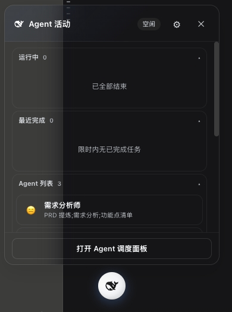 | 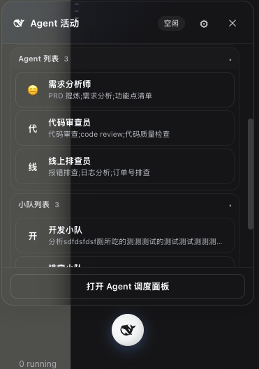 | 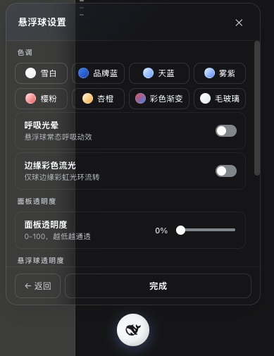 |

### Main panel (host right tab "Agent 调度")

| Overview | Agents | Squads | History |
| --- | --- | --- | --- |
| 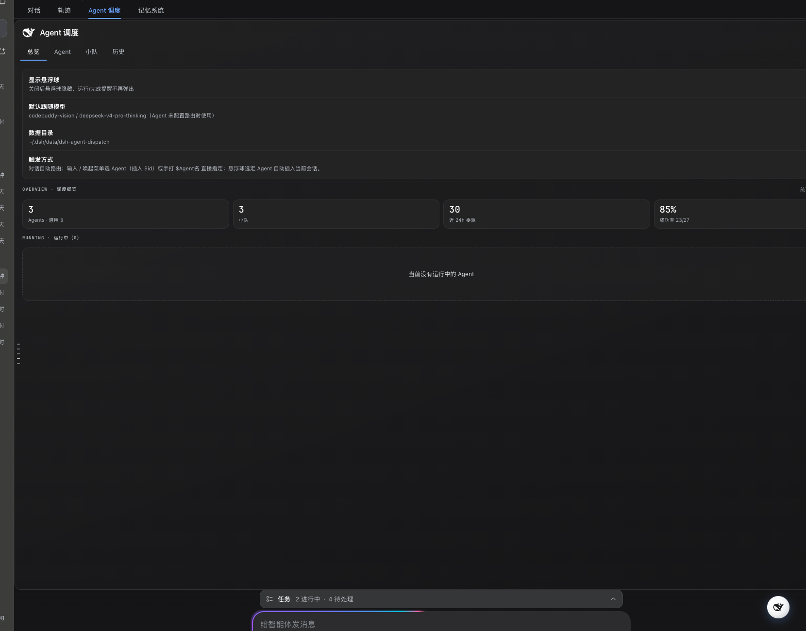 | 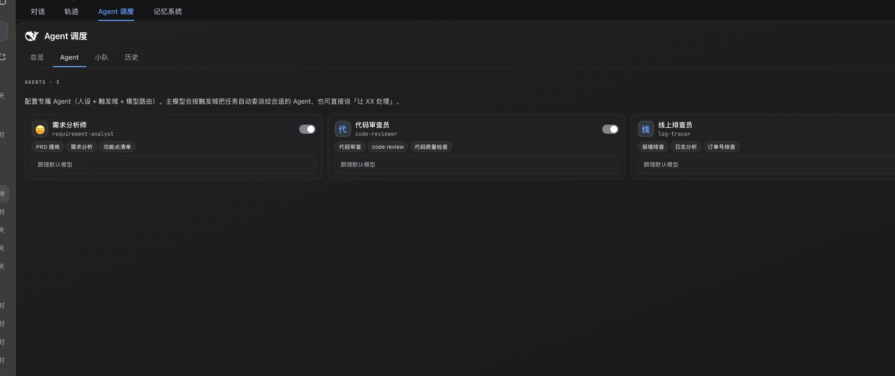 | 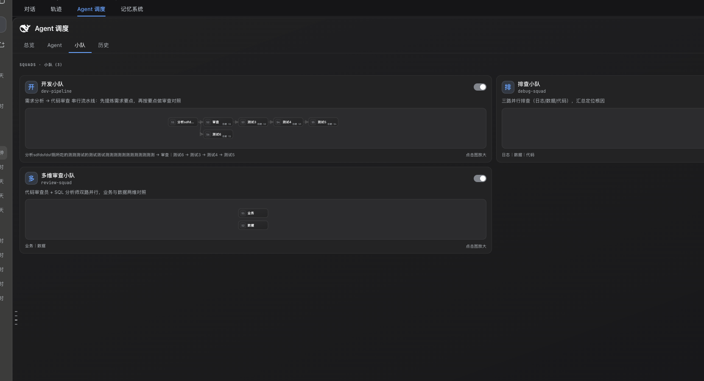 | 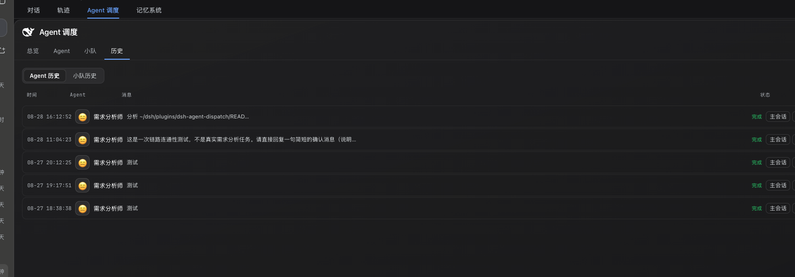 |

## 5 model tools

| Tool | Purpose |
| --- | --- |
| `agent_dispatch(agentId, task)` | Dispatch a self-contained task to an agent, returns childId; result arrives as a subagent notice |
| `agent_followup(childId, message)` | Follow up with an existing agent (context continues) |
| `agent_list()` | List agents (id / trigger domain / routes); call first when unsure which agent fits |
| `agent_squad(squad_id, goal)` | Expand a goal through a squad template; dependency results auto-injected |
| `agent_import_skill(skillDir?)` | Import `~/.dsh/skills/<name>/SKILL.md` as an agent |

## Usage

### 1. Create agents first

The plugin starts empty. Define your agents:

- **Panel**: main panel → "Agents" tab → "+ New Agent" → fill id / name / triggers / system prompt / model routes.
- **From skill**: `agent_import_skill("my-skill")` turns a skill's body into the persona and its description into triggers. Call `agent_import_skill()` with no argument to list importable skills.
- **Edit file**: edit `$DSH_HOME/data/dsh-agent-dispatch/agents.json` (format below).

### 2. Three trigger paths

1. **Automatic routing**: a task matching an agent's `triggers` makes the lead agent call `agent_dispatch` instead of doing it inline.
2. **`/` menu**: type `/` to open the candidate menu (Agent + squad groups); picking inserts `$id ` and the lead agent treats it as an explicit dispatch.
3. **Floating ball**: tap to open the popup → tap an Agent/squad card → `$id ` is inserted into the composer; hit Enter to dispatch.

### 3. Explicit `$` prefix

When a message starts with `$<id> ` (e.g. `$log-tracer check the slow orders query`), the lead agent dispatches the rest as the task via `agent_dispatch` (or `agent_squad` for a squad id), no questions, no rerouting.

### 4. Follow-up and continuation

Dispatching to the same agent again reuses its old child via `agent_followup` (context continues) instead of creating a new one. You can also call `agent_followup(childId, message)` manually.

### 5. Multi-angle / pipeline (squads)

When a goal needs both analysis and review, or multi-path debugging, create a squad template first (panel "Squads" tab), then `agent_squad(squad_id, goal)`. Steps support dependencies: empty `dependsOn` = first batch parallel, otherwise wait for previous step results (`{prev:N}` placeholder).

## Dispatch / trigger flow

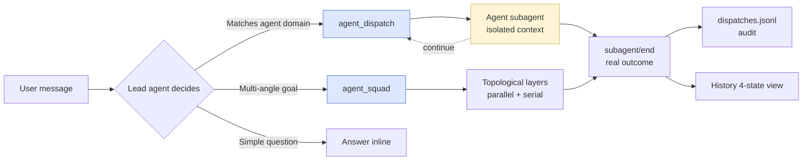

## Squad state machine

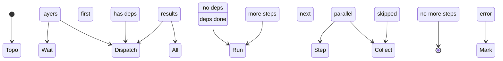

## Lifecycle & data channel

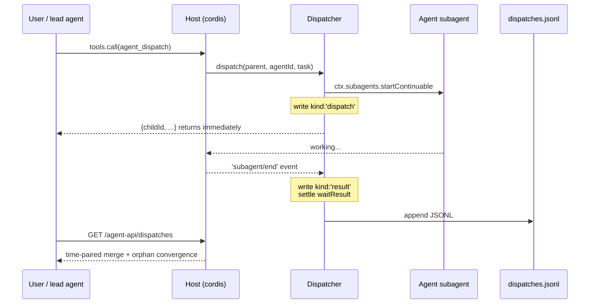

- **Write**: `dispatch` returns childId immediately; the host `subagent/end` event triggers `onChildEnd` to record the real outcome.
- **Merge**: `mergeDispatchHistory` pairs `kind:'dispatch'` ↔ `kind:'result'` by childId in time order; unterminated rows not in the live active map converge to `orphan:true`.
- **Rotation**: `dispatches.jsonl` caps at 2000 lines, auto-rewrites to keep the tail.

## Install

### GitHub one-liner

```sh
dsh plugin --profile <your-profile> add github:kiligzzz/dsh-agent-dispatch
```

### Local source link

```sh
dsh plugin --profile <your-profile> add /path/to/dsh-agent-dispatch
```

### Data directory

```
$DSH_HOME/data/dsh-agent-dispatch/
├── agents.json     # agent list
├── squads.json     # squad list
└── dispatches.jsonl # decision log (max 2000 lines, auto-rotating)
```

`$DSH_HOME` defaults to `~/.dsh`.

## Configuration

### Agents (`agents.json`)

```json
{
  "version": 1,
  "agents": [
    {
      "id": "log-tracer",
      "name": "线上排查员",
      "emoji": "🛠️",
      "triggers": "报错日志；订单异常；接口报错；线上问题排查",
      "systemPrompt": "…… (full agent system prompt / persona)",
      "routes": [
        { "provider": "deepseek-official", "model": "deepseek-v4", "effort": "high" },
        { "provider": "kimi-coding", "model": "k3-256k", "effort": "high" }
      ],
      "enabled": true
    }
  ]
}
```

- `routes`: model priority table; the first failure auto-fails over to the next; empty inherits the session's current model.
- `effort`: `minimal/low/medium/high/xhigh/max` (xhigh/max clamped to high).
- Changes take effect immediately — **no restart** (effective next turn).

### Squads (`squads.json`)

```json
{
  "version": 1,
  "squads": [
    {
      "id": "my-squad",
      "name": "My squad",
      "emoji": "",
      "description": "example",
      "enabled": true,
      "steps": [
        { "agentId": "log-tracer",   "phase": "logs", "dependsOn": [], "instruction": "{input}" },
        { "agentId": "sql-analyst",  "phase": "data", "dependsOn": [], "instruction": "Verify tables:\n{input}" },
        { "agentId": "code-reviewer", "phase": "review", "dependsOn": [0, 1], "instruction": "Based on logs+data:\n{input}\n\n【Logs】\n{prev:0}\n\n【Data】\n{prev:1}" }
      ]
    }
  ]
}
```

- `dependsOn` is an array of step indices; empty = first batch parallel.
- `instruction` supports two placeholders: `{input}` (full goal) and `{prev:N}` (step N result summary).
- Validation matches the `agent_squad` tool: out-of-range/self-reference/non-array report specific errors; cycles report "dependency cycle".

## UI overview

### Main panel 4 tabs

| Tab | Content |
| --- | --- |
| **Overview** | settings card (show FAB / default model / data dir / trigger modes) + stat cards (agents / squads / success rate / last 24h) + running list + agent usage ranking + recently completed |
| **Agents** | user-defined agents; card grid; click to edit; toggle enable/disable |
| **Squads** | user-defined squads; card grid; click to edit; inline flow-graph SVG thumbnail; click to enlarge |
| **History** | agent / squad segmented view; agent rows by time, squad rows aggregate one run; expand for flow graph + task detail + jump |

### Floating action ball

- **Position**: bottom-right by default, freely draggable (no edge snap), position in `localStorage` (`ad-fab-pos`).
- **Effects**: 8 tones (snow / brand blue / sky / mist purple / cherry / apricot / rainbow / glass), edge glow, breathing effects (`fab-live` white / `done-glow` color), panel opacity 0-100.
- **Master switch**: main panel "Overview" top "Show FAB" toggle, off forces hidden.
- **Popup**: opens from the ball center, four card sections (running / recently completed / Agent list / squad list); tap a card to dispatch inline or jump to the subagent session.

### Session header back button

Mounted to host `conversation.session.header.actions` slot (id `agent-dispatch-back`, order 10). A navigation stack records session titles before each jump (max 20); back pops in order. No button when the stack is empty.

### Jump chain

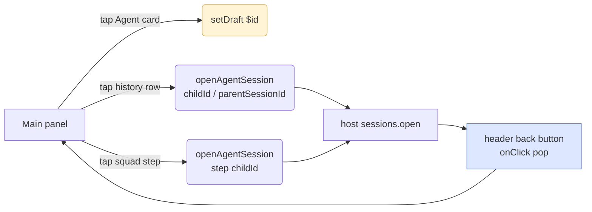

## Design tradeoffs

- **Zero `@deepseek-ai/dsh-tools` dependency** (avoids official dual-instance bug #1697/#783): tools register via `ctx.tools.register` bare-object minimal shape.
- **No task scheduler reinvention**: continuation / persistence / follow-up reuse the host `ctx.subagents`; this plugin only adds "agent definition + routing + failover + audit".
- **No state-machine library**: state diagrams (squad orchestration) use host-native Promise.all + topological layering.
- **CSS variables map fully to DSH semantic tokens** (`--dsw-alias-*` / `--dsw-static-*`), light/dark auto-follow, no hardcoded `#RRGGBB`.
- **Switch/radio/slider unified two-state look** (gray track + white knob, position distinguishes state).

## Relationship with similar plugins

| Plugin | Difference |
| --- | --- |
| `dsh-agent-teams` etc. | `agent_*` tool prefix doesn't collide, but running two dispatch systems in one session creates redundant subagents — pick one. |
| `dsh-mnemon` | Memory system, no overlap. |
| `dsh-sentinel` | Background sentinel (file/port/process watch), no overlap. |
| `dsh-session-archive` | Session archive/search, no overlap. |

## Development

```sh
node verify.mjs   # consistency assertions + smoke (200+ hard rules)
```

Covers: package-name consistency, `dsh.client.platform:"web"`, `__ModuleLoader__.load` classic script, tabs / FAB / history / squad graph / edit modal invariants.

## Roadmap

- **v1.2**: token metering, agent-level `toolFilter`, agent command panel.
- **v1.3**: streaming progress for squad parallel steps.
- **v2.0**: dsh-mnemon integration — cross-session knowledge inheritance.

## License

MIT
