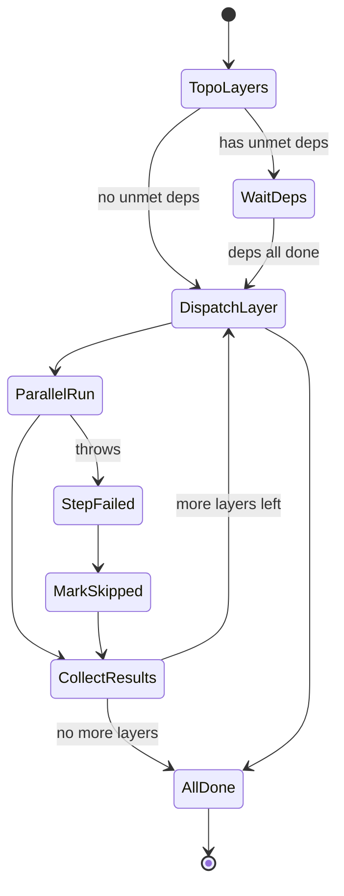
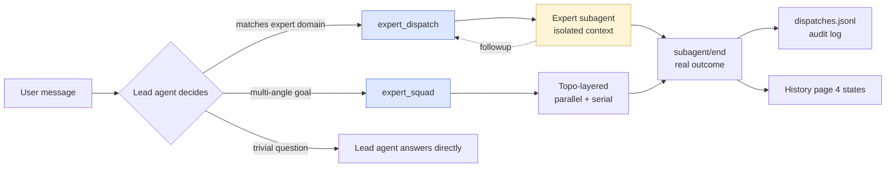
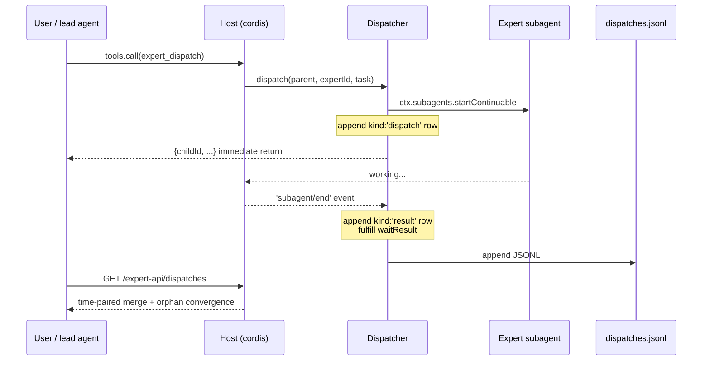
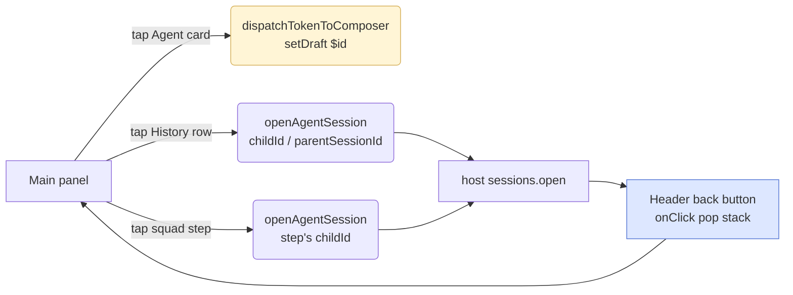

# dsh-agent-dispatch

> DeepSeek Harness plugin · Pre-configured expert agents + automatic routing + squad orchestration
>
> **简体中文** | English

Say one sentence; the lead agent routes the task by domain to a continuable expert subagent with a fixed persona, isolated context, and its own model route. Failed routes fail over automatically. Multi-angle goals can flow through a squad template (requirements → review serial / three-way debugging parallel / two-way review parallel) where dependency results are auto-injected.

The main panel is mounted to the host's native right tab **Agent 调度**, with a floating action ball anchored at the bottom-right for one-click access to running / recently completed / Agent list / squad list.

## Quick screenshot index

| Entry | View |
| --- | --- |
| Main panel → **总览** (Overview) | `docs/screenshots/overview.png` |
| Main panel → **Agent** | `docs/screenshots/agents.png` |
| Main panel → **小队** (Squads) | `docs/screenshots/squads.png` |
| Main panel → **历史** (History) | `docs/screenshots/history.png` |
| Floating action ball | `docs/screenshots/fab.png` |
| FAB popup (Recently completed) | `docs/screenshots/fab-popup.png` |

> Clone the repo and capture real screenshots yourself; the image slots are placeholders for community PRs.

## 5 model tools

| Tool | Purpose |
| --- | --- |
| `expert_dispatch(expertId, task)` | Dispatch a self-contained task to an expert; returns childId immediately; result arrives as a subagent notice |
| `expert_followup(childId, message)` | Follow-up on a live expert (context preserved) |
| `expert_list()` | List the expert directory (id / domain / routes); call before dispatch when uncertain |
| `expert_squad(squad_id, goal)` | Fan out a goal across a preset squad template; dependency outputs feed dependents automatically |
| `expert_import_skill(skillDir?)` | Import `~/.dsh/skills/<name>/SKILL.md` as an expert |

## 4 built-in experts

| Expert | id | Domain |
| --- | --- | --- |
| Requirement Analyst | `requirement-analyst` | PRD distillation, backend feature lists, edge cases, open questions |
| Code Reviewer | `code-reviewer` | Multi-dimensional review (business / spec / transaction / data / exception / interface / performance) with severity grading |
| Log Tracer | `log-tracer` | Error logs, order IDs, API exceptions → timeline + call chain + hypothesis list |
| SQL Analyst | `sql-analyst` | Schema inspection, query writing, data reconciliation, performance analysis (read-only by default) |

Avatar rule: custom emoji → first-character mono → DSH official logo (fallback).

## 3 built-in squads

| Squad | Structure | Use case |
| --- | --- | --- |
| `dev-pipeline` | Requirements → Review (serial; prior output injected into next step) | Wrap-up commit review |
| `debug-squad` | Log + SQL + Code (3-way parallel) | Production incident triage |
| `review-squad` | Business + Data (2-way parallel) | Need both business and data review |

Squad orchestration state machine:



## Dispatch & trigger surface



3 trigger entry points:

1. **Auto-routing by lead agent**: when a task matches an expert's `triggers` field, the lead agent dispatches via `expert_dispatch` per the injected policy prompt section.
2. **`/` trigger menu**: typing `/` opens a candidate menu (the `Agent` group after the command group, containing both agents and squads); picking an entry inserts `$id ` into the input.
3. **Floating action ball**: tap the ball → FAB panel → tap an agent or squad card → `conversation.input.shell.setDraft("$id ")` fills the input.

> When a user message starts with `$<id> ` (e.g. `$sql-analyst 查下 orders 慢查询`), the lead agent passes the rest of the message as the task to `expert_dispatch` for that id (squad ids use `expert_squad`); no follow-up questions, no re-routing. The `$` prefix comes from the `/` menu insertion or is typed manually.

## Lifecycle & data plane



- **Write**: `dispatch` returns childId immediately; the host's `subagent/end` event triggers `onChildEnd` to write the real outcome (stopReason / lastAssistantMessage).
- **Merge**: `mergeDispatchHistory` pairs `kind:'dispatch'` ↔ `kind:'result'` rows by childId in time order; rows with no live child but no result converge to `orphan:true` (state unknown).
- **Log rotation**: `dispatches.jsonl` capped at 2000 lines; older entries are truncated.

## Install

### One-line GitHub

```sh
dsh plugin --profile <your profile> add github:kiligzzz/dsh-agent-dispatch
# Alt via npm tag: dsh plugin --profile <X> add @kiligzzz/dsh-agent-dispatch@1.0.0
```

### Local source link

```sh
dsh plugin --profile <your profile> add /Users/ivan/dsh/plugins/dsh-agent-dispatch
```

### Data directory

Registry and logs live at:

```
$DSH_HOME/data/dsh-agent-dispatch/
├── experts.json     # expert list (with deletedIds persistence marker)
├── squads.json      # squad list
└── dispatches.jsonl # decision log (auto-rotated at 2000 lines)
```

`$DSH_HOME` defaults to `~/.dsh`.

## Configuration

### Experts (`experts.json`)

```json
{
  "version": 1,
  "deletedIds": [],
  "experts": [
    {
      "id": "log-tracer",
      "name": "Log Tracer",
      "emoji": "🛠️",
      "triggers": "error logs; order anomalies; API errors; production debugging",
      "systemPrompt": "… (full expert system prompt)",
      "routes": [
        { "provider": "deepseek-official", "model": "deepseek-v4", "effort": "high" },
        { "provider": "kimi-coding", "model": "k3-256k", "effort": "high" }
      ],
      "enabled": true
    }
  ]
}
```

- `routes`: priority list; first failure falls over to the next. Empty array inherits the current session model.
- `effort`: `minimal/low/medium/high/xhigh/max` (xhigh/max clamped to high by the host).
- Deleting a built-in expert is durable (`deletedIds` marker); re-upserting the same id restores it.
- Changes apply on the **next turn — no restart**.

### Squads (`squads.json`)

```json
{
  "version": 1,
  "deletedIds": [],
  "squads": [
    {
      "id": "my-squad",
      "name": "My Squad",
      "emoji": "",
      "description": "Example",
      "enabled": true,
      "steps": [
        { "expertId": "log-tracer",    "phase": "logs",  "dependsOn": [],    "instruction": "{input}" },
        { "expertId": "sql-analyst",   "phase": "data",  "dependsOn": [],    "instruction": "Reconcile data:\n{input}" },
        { "expertId": "code-reviewer", "phase": "review", "dependsOn": [0, 1], "instruction": "Given logs and data:\n{input}\n\n[Logs conclusion]\n{prev:0}\n\n[Data conclusion]\n{prev:1}" }
      ]
    }
  ]
}
```

- `dependsOn`: array of step indices; empty array = first layer (parallel).
- `instruction` supports two placeholders: `{input}` (user goal verbatim) and `{prev:N}` (N-th step's result summary).
- Validation rules (same as the `expert_squad` tool): out-of-bounds / self-reference / non-array errors are reported separately; a cycle is reported as "dependency cycle".

## UI overview

### Main panel — 4 sub tabs

| Sub tab | Content |
| --- | --- |
| **Overview** | Top settings card (FAB visibility / default model / data dir / trigger) + stats (experts / squads / success rate / last 24h) + running list + expert usage bar chart + recently completed |
| **Agent** | 4 built-in + user-defined; card grid, 4 per row (auto single-column on narrow panels); tap-to-edit modal; on/off via switch |
| **Squad** | 3 built-in + user-defined; card grid, 2 per row; tap-to-edit modal; card embeds an SVG execution-flow thumbnail; tap the graph to open a modal view |
| **History** | Agent / Squad segmented switch; agent rows ordered by time, squad rows aggregate one run; expanded section contains the execution-flow graph (status-colored nodes + step details) + task detail + jump button |

### Floating action ball

- **Position**: default bottom-right 60×60, freely draggable (no edge snap); position persisted to `localStorage` (key `ad-fab-pos`).
- **Visual effects**: 8 color tones (snow / sky / glass / cherry / rose / mist / violet / rainbow), 8-segment edge flow (independent ring `ad-fab-edge-ring`), breathing animation classes (`ad-fab-breathe` / `fab-live` white pulse / `done-glow` color glow), opacity 0-100.
- **Master switch**: in the Overview top settings card; off forces hidden with priority over display mode (always / auto / never).
- **Popup**: 340px wide, anchored to the ball center (via `transform-origin`); four card sections (running / recently completed / agent list / squad list); tap a card to dispatch in-place via `dispatchTokenToComposer` or jump to a sub-agent session via `openAgentSession`.

### Session header back button

Mounted in the host's `conversation.session.header.actions` slot (id `agent-dispatch-back`, order 10). The navigation stack records each jump's source session title (cap 20); clicking back pops the stack. When the stack is empty the button does not render.

### Navigation graph



## Design choices

- **Zero `@deepseek-ai/dsh-tools` dependency** (avoids the official dual-instance bug #1697/#783): tools register via the minimal bare `ctx.tools.register` shape.
- **No reinvented task scheduler**: continuation, persistence, and follow-ups all reuse the host's `ctx.subagents`; the plugin only contributes expert definitions, routing policy, failover, and audit.
- **No state-machine library**: state graphs (e.g. squad orchestration) are implemented with the host's native `Promise.all` + topo-layering; zero extra dependencies.
- **CSS variable layer fully maps to DSH semantic tokens** (`--dsw-alias-*` / `--dsw-static-*`); light/dark themes follow automatically; no hard-coded `#RRGGBB`.
- **Unified two-state controls** (switches / radios / sliders all gray base + white knob, position-distinguished); no color / dark-inverse state distinction — a cross-plugin preference for all DSH plugins.

## Relationship with similar plugins

| Plugin | Distinction |
| --- | --- |
| `dsh-agent-teams` and other leader-style plugins | Tool-name `expert_*` prefix does not collide, but running two dispatch systems in the same session creates redundant subagents — pick one. |
| `dsh-mnemon` | Memory system, no overlap. |
| `dsh-sentinel` | Background watchers (file / port / process), no overlap. |
| `dsh-session-archive` | Session archive / search, no overlap. |

## Development

```sh
node verify.mjs   # consistency assertions + smoke (covers 200+ hard rules)
```

Verification covers: package-name six-place consistency, `dsh.client.platform:"web"` required, `__ModuleLoader__.load` must be classic script, ModuleLoader id must be the bare package name, and visual / behavioral invariants across sub-tabs, FAB, history, squad graph, and edit modals.

## Roadmap

- **v1.1**: token metering; per-expert `toolFilter` (scope allowed tools); `/expert`-style agent command palette.
- **v1.2**: streaming progress for parallel squad steps (started in v0.9.36, completing in v1.2).
- **v2.0**: integration with `dsh-mnemon` — cross-session knowledge inheritance (expert subagents can read the parent session's memory).

## License

MIT
