# dsh-agent-dispatch

[](https://github.com/kiligzzz/dsh-agent-dispatch/actions/workflows/ci.yml)

> DeepSeek Harness plugin · User-defined agents + automatic routing + squad orchestration
>
> **简体中文** | English

Say one sentence; the lead agent routes the task by domain to a continuable agent subagent with a fixed persona, isolated context, and its own model route. Failed routes fail over automatically. Multi-angle goals can flow through a squad template where dependency results are auto-injected.

The main panel is mounted to the host's native right tab **Agent 调度**, with a floating action ball anchored at the bottom-right for one-click access to running / recently completed / Agent list / squad list.

**No built-in agents or squads**: starts empty — define everything yourself via the panel "+ New Agent" form, import from `~/.dsh/skills`, or edit `agents.json` directly.

## Quick screenshot index

### Floating action ball

| Idle 1 | Idle 2 | Running | Done |
| --- | --- | --- | --- |
|  |  |  |  |

| Popup (running) | Popup (agents + squads) | FAB settings |
| --- | --- | --- |
| 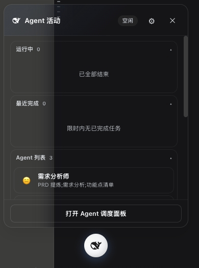 | 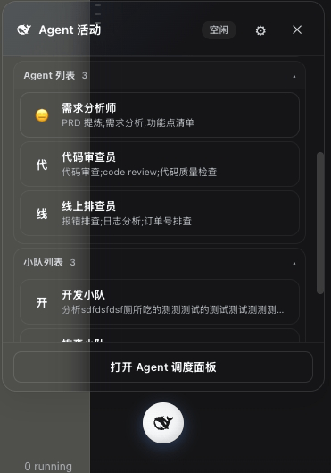 | 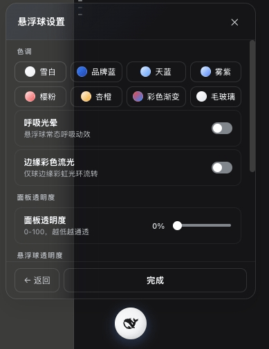 |

### Main panel (host right tab "Agent 调度")

| Overview | Agents | Squads | History |
| --- | --- | --- | --- |
| 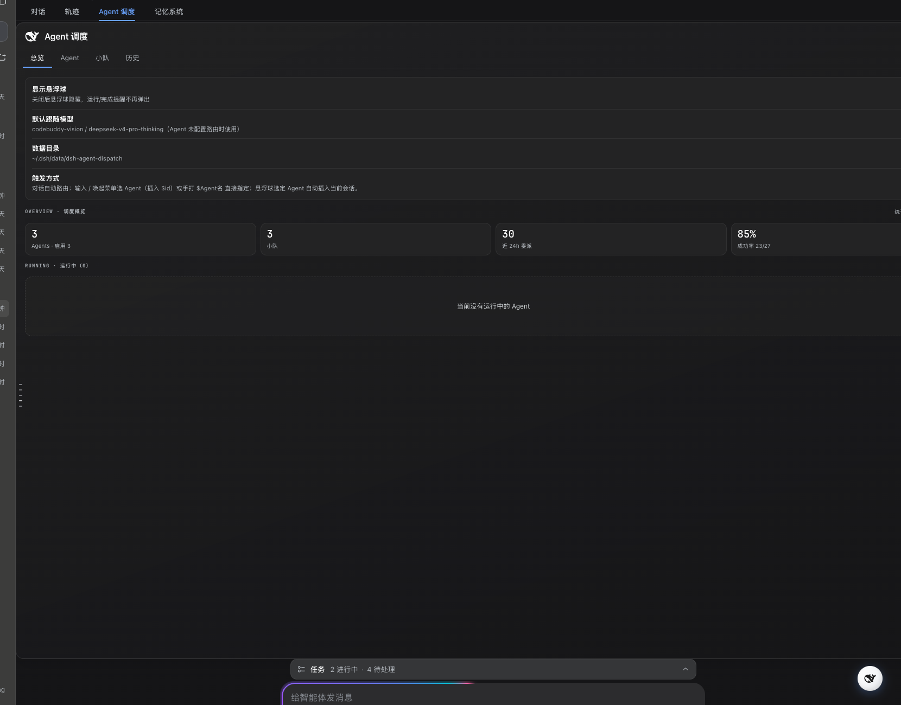 | 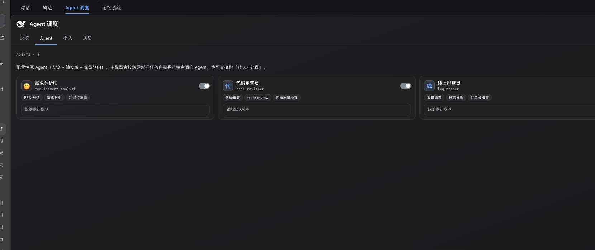 | 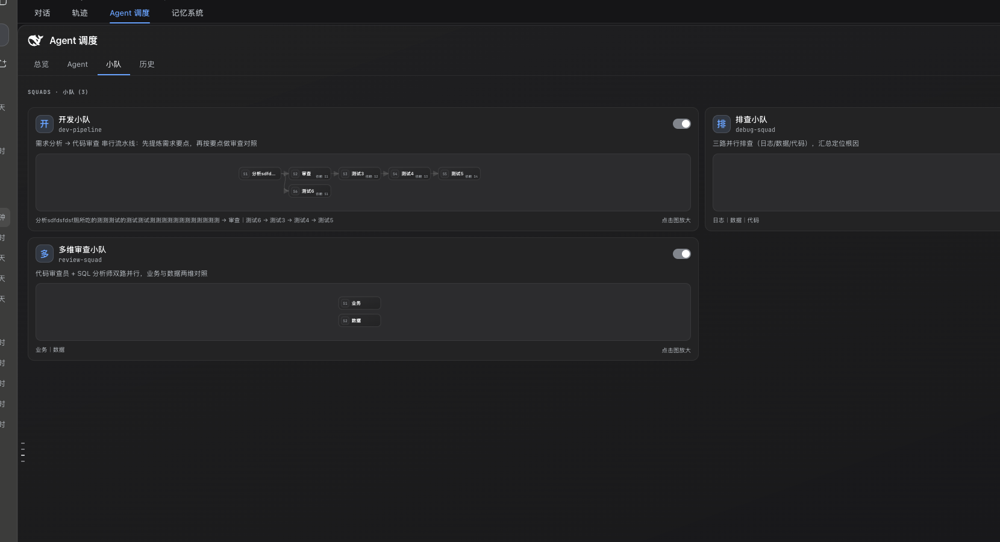 | 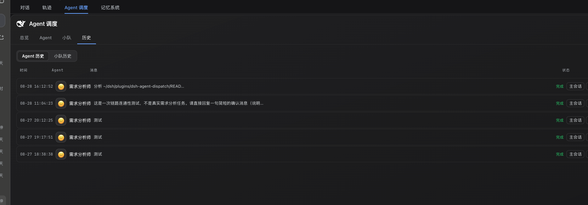 |

## 5 model tools

| Tool | Purpose |
| --- | --- |
| `agent_dispatch(agentId, task)` | Dispatch a self-contained task to an agent, returns childId; result arrives as a subagent notice |
| `agent_followup(childId, message)` | Follow up with an existing agent (context continues) |
| `agent_list()` | List agents (id / trigger domain / routes); call first when unsure which agent fits |
| `agent_squad(squad_id, goal)` | Expand a goal through a squad template; dependency results auto-injected |
| `agent_import_skill(skillDir?)` | Import `~/.dsh/skills/<name>/SKILL.md` as an agent |
| `agent_failover(childId)` | Hand a **route that is waiting for a failover decision** over to the next route; the replacement becomes your direct child (two-way messaging works) |

## Usage

### 1. Create agents first

The plugin starts empty. Define your agents:

- **Panel**: main panel → "Agents" tab → "+ New Agent" → fill id / name / triggers / system prompt / model routes.
- **From skill**: `agent_import_skill("my-skill")` turns a skill's body into the persona and its description into triggers. Call `agent_import_skill()` with no argument to list importable skills.
- **Edit file**: edit `$DSH_HOME/data/dsh-agent-dispatch/agents.json` (format below).

### 2. Three trigger paths

1. **Automatic routing**: a task matching an agent's `triggers` makes the lead agent call `agent_dispatch` instead of doing it inline.
2. **`/` menu**: type `/` to open the candidate menu (Agent + squad groups); picking inserts `$id ` and the lead agent treats it as an explicit dispatch.
3. **Floating ball**: tap to open the popup → tap an Agent/squad card → `$id ` is inserted into the composer; hit Enter to dispatch.

### 3. Explicit `$` prefix

When a message starts with `$<id> ` (e.g. `$log-tracer check the slow orders query`), the lead agent dispatches the rest as the task via `agent_dispatch` (or `agent_squad` for a squad id), no questions, no rerouting.

### 4. Follow-up and continuation (smart same-role subagent reuse)

Since v1.5.1, `agent_dispatch` decides reuse vs spawn **per task** (default `reuse:"auto"`):

- **Progressive continuation** (continuation wording like 继续/接着/追加/continue/follow-up, or shared files/terms) → reuses the matching subagent via `send_message` with full context;
- **Independent new task** (new domain, new files, no continuation signal) → **spawns a fresh subagent**, avoiding context pollution and token growth;
- **Targeted continuation** (v1.5.3): when the subagent to reuse is NOT the most recent one (a separated older thread) — call `agent_children` to find its `childId` (with recent task labels and running/idle/ready status), then `agent_dispatch(agentId, task, childId=...)`. **Continuation is keyed by the durable session id only**: whether the subagent's process/activation is live, idle, or already recycled does not matter (cold resume from the persisted session is automatic). Cross-session continuation is not possible (the host enforces parent adjacency).
- Explicit control: `reuse:"reuse"` forces reuse of the most recent same-role child, `reuse:"fresh"` forces a new one; `agent_followup(childId, message)` still targets a specific child.

The pool is a per-(session, agent) LRU of the 3 most recent children, so continuations of different task threads each hit their own subagent.

**How subagents that are no longer reused get recycled**:

- **In-process spawn children** (default): no OS process — the host releases the resident activation automatically after each settled turn (the child becomes `ready`); the plugin adds an `idleReleaseMs` (default 10 min) safety-net release; only the durable session file stays on disk (the host has no deletion API).
- **ACP children** (deveco etc.): the background process is owned by `dsh-plugin-product-subagents` — every turn end starts an `idleTimeoutMs` (default 10 min) countdown; if unused by then, the ACP process is SIGTERMed; reuse cancels the countdown; after process death the remote session can be reconnected via the durable registry / log marker, so continuity survives recycling.
- **Explicit close**: when a thread is confirmed done, the main agent can call `agent_close` (`childId` for one subagent, `agentId` for all idle subagents of that agent) — reuse eligibility is dropped immediately and resident resources are released; a running subagent is not interrupted (it is recycled naturally when its task settles). ACP processes are still reaped by the idle timer; never kill them manually.

- **Idle recycling**: after a child finishes a turn, if it stays unused for `idleReleaseMs` (default 10 min) its resident resources are released (`drainContinuableChildren`); the durable session is kept, so the next reuse cold-resumes with context intact.
- **Exploration roles**: set the agent's `reusePolicy` to `fresh` (GUI "子代理复用策略") to spawn an independent child per dispatch — each exploration starts clean.
- Squad steps (`agent_squad`) always use dedicated children (concurrency-safe, unaffected by the reuse policy).

### 5. Multi-angle / pipeline (squads)

When a goal needs both analysis and review, or multi-path debugging, create a squad template first (panel "Squads" tab), then `agent_squad(squad_id, goal)`. Steps support dependencies: empty `dependsOn` = first batch parallel, otherwise wait for previous step results (`{prev:N}` placeholder).

## Dispatch / trigger flow

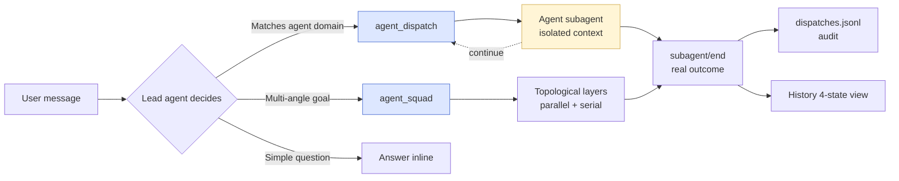
```mermaid
flowchart LR
    A[User message] --> B{Lead agent decides}
    B -- Matches agent domain --> C[agent_dispatch]
    B -- Multi-angle goal --> D[agent_squad]
    B -- Simple question --> E[Answer inline]
    C --> F[Agent subagent<br/>isolated context]
    D --> G[Topological layers<br/>parallel + serial]
    F --> H[subagent/end<br/>real outcome]
    G --> H
    H --> I[dispatches.jsonl<br/>audit]
    H --> J[History 4-state view]
    F -.continue.-> C
    style C fill:#dde7ff,stroke:#5b7bd6
    style D fill:#dde7ff,stroke:#5b7bd6
    style F fill:#fff5d6,stroke:#d6b15b
```

## Squad state machine

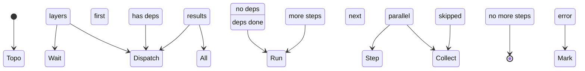
```mermaid
stateDiagram-v2
    [*] --> Topo layers
    Topo layers --> Dispatch first batch: no deps
    Topo layers --> Wait deps: has deps
    Wait deps --> Dispatch first batch: deps done
    Dispatch first batch --> Run parallel
    Run parallel --> Collect results
    Collect results --> Dispatch next layer: more steps
    Collect results --> All done: no more steps
    Dispatch next layer --> Run parallel
    All done --> [*]
    Run parallel --> Step failed: error
    Step failed --> Mark skipped
    Mark skipped --> Collect results
```

## Lifecycle & data channel

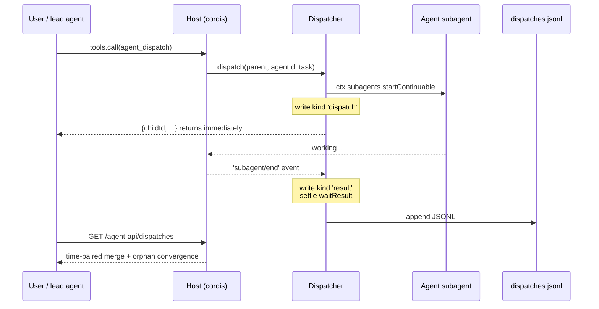
```mermaid
sequenceDiagram
    participant U as User / lead agent
    participant H as Host (cordis)
    participant D as Dispatcher
    participant E as Agent subagent
    participant L as dispatches.jsonl
    U->>H: tools.call(agent_dispatch)
    H->>D: dispatch(parent, agentId, task)
    D->>E: ctx.subagents.startContinuable
    Note over D: write kind:'dispatch'
    D-->>U: {childId, ...} returns immediately
    E-->>H: working...
    H-->>D: 'subagent/end' event
    Note over D: write kind:'result'<br/>settle waitResult
    D->>L: append JSONL
    U->>H: GET /agent-api/dispatches
    H-->>U: time-paired merge + orphan convergence
```

- **Write**: `dispatch` returns childId immediately; the host `subagent/end` event triggers `onChildEnd` to record the real outcome.
- **Merge**: `mergeDispatchHistory` pairs `kind:'dispatch'` ↔ `kind:'result'` by childId in time order; unterminated rows not in the live active map converge to `orphan:true`.
- **Rotation**: `dispatches.jsonl` caps at 2000 lines, auto-rewrites to keep the tail.

## Install

### GitHub one-liner

```sh
dsh plugin --profile <your-profile> add github:kiligzzz/dsh-agent-dispatch
```

### Local source link

```sh
dsh plugin --profile <your-profile> add /path/to/dsh-agent-dispatch
```

### Data directory

```
$DSH_HOME/data/dsh-agent-dispatch/
├── agents.json      # agent list
├── squads.json      # squad list
├── fab-config.json  # FAB config (hidden state / position / mode / effects)
└── dispatches.jsonl # decision log (max 2000 lines, auto-rotating)
```

`$DSH_HOME` defaults to `~/.dsh`.

## Configuration

### Agents (`agents.json`)

```json
{
  "version": 1,
  "agents": [
    {
      "id": "log-tracer",
      "name": "线上排查员",
      "emoji": "🛠️",
      "triggers": "报错日志；订单异常；接口报错；线上问题排查",
      "systemPrompt": "…… (full agent system prompt / persona)",
      "routes": [
        { "provider": "deepseek-official", "model": "deepseek-v4", "effort": "high" },
        { "provider": "kimi-coding", "model": "k3-256k", "effort": "high" }
      ],
      "enabled": true
    }
  ]
}
```

- `routes`: model priority table; the first failure auto-fails over to the next; empty inherits the session's current model.
- `provider` comes in two kinds (both selectable in the form since v1.11.12; resolved at runtime via `ctx.subagents.getProvider`): **LLM routes** (host adapters, e.g. `deepseek-official`) require a non-empty `model`; **ACP product routes** (registered by `dsh-plugin-product-subagents`, e.g. `qoder`/`deveco`/`opencode`) may omit `model` or use `default`, meaning "let the product pick".
- `effort`: the valid set depends on the provider/model — LLM from the adapter (`llm.resolveModelInfo().reasoning.efforts`), ACP from the product catalog (`provider-catalog.json`, model-level first, provider-level fallback); empty = don't specify, use the model/product default. The form builds its dropdown from these sources and falls back to free text when no catalog is available.
- Dropdown labels are display names, stored values stay executable: catalog entries may carry `modelOptions`/`effortOptions`/`modelEffortOptions` (`[{value,name?,description?}]`); options render `name ?? value` with `description` as tooltip, while `agents.json` always stores `value` (the string ACP's `session/set_config_option` accepts).
- A wrong `model`/`effort` never breaks the dispatch and is never silent: the product falls back to its own default, the form flags 「不在模型表中，可能不生效」, `dispatches.jsonl` records `configNote` (suspect value pre-check) plus the requested `effort`, and a separate `kind:"config"` row records `requested` → `effective` when the product actually rejects the setting (`product-subagents/config-option-error`; such rows are diagnostics, not dispatches, and are hidden from the history page). Config edits apply to **newly spawned** children — a reused, already-resident thread keeps what it was created with.
- `reusePolicy` (v1.5.0; v1.5.1: `reuse` = smart): `reuse` (default) = auto — reuse the same subagent when the task continues previous work (continuation wording / shared files & terms), spawn a fresh one for independent tasks (override per call with `agent_dispatch` `reuse:"reuse"/"fresh"`); `fresh` = spawn a new child on every dispatch (for exploration-style roles). Omitted values default to `reuse`.
- Changes take effect immediately — **no restart** (effective next turn).

### Squads (`squads.json`)

```json
{
  "version": 1,
  "squads": [
    {
      "id": "my-squad",
      "name": "My squad",
      "emoji": "",
      "description": "example",
      "enabled": true,
      "steps": [
        { "agentId": "log-tracer",   "phase": "logs", "dependsOn": [], "instruction": "{input}" },
        { "agentId": "sql-analyst",  "phase": "data", "dependsOn": [], "instruction": "Verify tables:\n{input}" },
        { "agentId": "code-reviewer", "phase": "review", "dependsOn": [0, 1], "instruction": "Based on logs+data:\n{input}\n\n【Logs】\n{prev:0}\n\n【Data】\n{prev:1}" }
      ]
    }
  ]
}
```

- `dependsOn` is an array of step indices; empty = first batch parallel.
- `instruction` supports two placeholders: `{input}` (full goal) and `{prev:N}` (step N result summary).
- Validation matches the `agent_squad` tool: out-of-range/self-reference/non-array report specific errors; cycles report "dependency cycle".

## Fallback chain (automatic route switching) and failure grading

An Agent's `routes` are an ordered failover chain. When one slot fails this plugin
switches to the next one and re-runs the **same** task text. **The replacement is
always a direct child of the main agent** (depth-1 sibling, never a grandchild of the
failing child) — so the main agent can `send_message` it, see it in `agent_children`,
and `interrupt_agent` it.

> **At any moment a single task has at most ONE replacement subagent.** Manual and
> automatic failover share the **same atomic claim** (`#claimHandoff`'s
> synchronous `has → set → run` block); the loser is idempotent and returns the same
> `childId`, never a second replacement. This is a mechanism guarantee, not a
> best-effort heuristic.

Key mechanics (v1.11.24):

- **The main agent owns the failover decision.** When a route fails the orchestrator
  sends the main agent a **waking** notice (idle → `followup`, running → `steer`;
  `inject` is non-waking and would go unread while the agent is idle) and exposes the
  idempotent tool **`agent_failover({ childId })`**. Calling it **terminates and
  releases the failed child (the plugin redeems its blocked wait) and dispatches the
  next route as a sibling child** — the main agent does **not** need to call
  `interrupt_agent` separately (the host scheduler waits for in-flight tools even on
  abort, so `interrupt_agent` cannot unblock a stuck `product_submit`; the real release
  is the plugin redeeming that promise). In `notify-then-auto` mode the plugin runs the
  exact same flow on timeout.
- The tool takes **only `childId`**: the task text, agent id, failing route, next
  route, tried list and error trail are all resolved by the orchestrator. The existing
  `agent_dispatch` has no provider/model parameter, so the main agent simply cannot
  express "switch to that route" — hence a dedicated tool.
- **Notice order (new semantics)**: (1) the waking failover notice → (2)
  `Background subagent <id> was stopped before it finished.` for the failed child →
  (3) the replacement's settlement notice. (2) is emitted unconditionally by the
  host's `notifySettlement` and **cannot be suppressed from the plugin side**, but it
  always lands *after* the explicit notice and is semantically true. The release
  order is fixed: **interrupt the old child → migrate the waiter → dispatch the
  sibling replacement → redeem the rendezvous**, so "old child released" is never
  earlier than "replacement exists".
- **No double failover**: when the failed child ends, `onChildEnd` still evaluates
  whether to auto-fail-over, and three gates stop it — `entry.inTurnChain`
  (durable, set **before** the notice goes out), a live rendezvous (transient), and the
  `activeTasks` live-sibling gate (the replacement is registered, so it is a natural
  second line of defence).
- The final failure report explains itself:
  `(step failed: …; tried 3 routes: deveco → EMPTY_RESPONSE …; opencode → RATE_LIMITED …;
  deepseek-official → …; automatic failover stopped: already on the last route)`.
- Failures are graded (`failover` / `fatal` / `interrupted`; the authority is the
  `info.grade` published by product-subagents): quota/rate-limit/empty-response/
  timeout/transport-death are `failover` (silent switch); auth failure, invalid
  arguments, syntax errors, unknown model, human rejection and an exhausted chain are
  `fatal` (**no** switch — retrying cannot help); human cancellation is `interrupted`.
  Anything unlisted falls back to `failover`, so only an explicitly `fatal` error stops
  a route switch.
- **A route whose failover was already handled is not retried again after the turn
  ends** (v1.11.23, kept in v1.11.24). The reason reads
  `; automatic failover stopped: already handled by the failover chain this turn
  (explicit or auto-on-timeout), not retried`. Without that gate the main agent would
  simultaneously hold the replacement and an out-of-turn sibling both working the same
  task — the same shape as the incident fixed in v1.11.22.
- **Requires product-subagents >= 0.7.4** (for the `failoverMode` / `notifyWaitMs`
  payload and the `FAILOVER_HANDED_OFF` termination semantics). Against 0.7.3 the
  behaviour degrades but stays **safe** (the old PSUB does not know `handedOff`, treats
  the post-handoff verdict as "no result" and rethrows; the old child was already
  interrupted and its rendezvous already cleared, so its turn ends normally and
  `inTurnChain` blocks a second failover). Against an even older version, or with
  `failoverInTurn: false`, the plugin falls back to post-settlement failover — which
  also dispatches a **sibling** replacement.

### Related configuration

| Key | Type | Default | Meaning |
|---|---|---|---|
| `failoverMode` | `"notify-then-auto"` \| `"notify"` \| `"auto"` | `notify-then-auto` | Failover hand-off mode. All three modes use a **sibling** replacement; they differ only in *who decides* and *when*:<br>· `notify-then-auto` (default) — send a waking notice + expose `agent_failover`, wait `notifyWaitMs`; if the main agent acts, it drives the failover explicitly; **on timeout the plugin dispatches a sibling replacement automatically**.<br>· `notify` — pure manual: only wait for the main agent; **on timeout the task fails** and no automatic failover happens.<br>· `auto` — the old fully-automatic feel: no waiting, no notice, dispatch the sibling immediately.<br>Env: `DSH_AGENT_DISPATCH_FAILOVER_MODE`. |
| `notifyWaitMs` | number | `90000` (90 s) | How long `notify` / `notify-then-auto` waits for the main agent's decision. On timeout: auto sibling failover (`notify-then-auto`) or failure with a self-explaining message (`notify`). Never an indefinite hang. Env: `DSH_AGENT_DISPATCH_NOTIFY_WAIT_MS`. |
| `failoverInTurn` | boolean | `true` | The failing child blocks waiting for the failover decision (so it does not settle first). `false` restores "fail over after settlement" (intermediate notices leak) for troubleshooting. Env: `DSH_AGENT_DISPATCH_FAILOVER_IN_TURN=0/1`. |
| `failoverWaitMs` | number | `900000` (15 min) | Compatibility: only the post-settlement fallback path (old product-subagents, or `failoverInTurn: false`) uses it. |
| `failoverGrades` | object | — | `{ "<error code>": "failover"\|"fatal"\|"interrupted" }` grading overrides; same name and meaning as product-subagents' `config.submitFailureGrades`. |

### Known boundaries (recorded honestly — please don't file these as bugs)

1. **The host's per-child settlement notice cannot be suppressed from the plugin side.**
   `Background subagent <childId> finished and will do no further work unless you send it
   more.` is produced and emitted **unconditionally** by the host
   (`@deepseek-ai/dsh-subagent` `lib/index.js:1255` — `notifySettlement` starts with
   `if (!activation.announced) return`, and `announced` is set unconditionally on admit
   at `:1837` followup / `:1957` first submission). This plugin avoids the intermediate
   notice **indirectly**: the failing slot always keeps a live child, so the host's
   `settlementState()` takes the `ownedChildren` branch and answers `wait` instead of
   settling. That path still holds for a plugin-only solution — but it leans on the
   host's internal state machine, not on a plugin-controlled switch.
   > The paragraph below is a reference for an upstream fix. **Not implemented here, and
   > no patch file was produced.**
   > A real fix needs the host to accept an explicit marker on the `startContinuable` spec
   > (e.g. `failoverGroup` / `suppressSettleNotice`) and to set `announced = true` at
   > `:1837` / `:1957` only when the child is the final slot of its failover group; the
   > plugin would then pass `isFinal = !#canFailover(entry)`. The host is a global npm
   > package that `npm i -g` overwrites, so this is deliberately not done plugin-side.
2. **A failover re-run starts from scratch with no idempotency guard.** `#retryOnChildFailure`
   re-dispatches the **same task text** to a fresh child, so side effects already half-written
   by the earlier slot (files, database rows, external calls) run again. The `activeTasks`
   dedup only skips an *automatic* retry when another sibling with the same task is live; it
   does **not** prevent duplicated side effects and does **not** block a manual re-dispatch
   (`dispatch()` has no same-task early return). Whether to add idempotency protection is the
   user's call — this version does not.
3. **The failing slot's turn is stretched until the chain is exhausted** (bounded by
   `failoverWaitMs`, 15 min by default), so that child takes no new `send_message` meanwhile.
   That is **not** message loss: the host queues the message in the child's Inbox, and
   `settlementState()`'s `inbox.hasPending` branch answers `wait` instead of settling, so the
   message is never cleared by the disposal's `keepInbox:false` cancel. On top of that this
   plugin **reroutes**: an appended message landing on an already-failed slot is redirected to
   the chain's currently live slot (`#liveHopFor` inside `followup()`), so it does not travel
   back to a dead product session and trigger another round of failover. If rerouting fails it
   falls back to the original target, and only throws when both paths fail — **never silently
   dropped**.

### Cost and boundaries

- **The parent waits longer**: the failing slot's turn now blocks until the chain is
  exhausted, bounded by `failoverWaitMs`. That wait does **not** consume a parent turn
  (the host does not wake it); what it adds is "the chain's runtime after the failing
  slot".
- Per-slot **retry and backoff** still live on the product side: product-subagents'
  `rateLimitRetries` / `rateLimitBackoffMs` / `requestsPerMinute` (default 3 retries,
  60s×2ⁿ backoff) are exhausted on the current slot first; only then does the chain move on.

## UI overview

### Main panel 4 tabs

| Tab | Content |
| --- | --- |
| **Overview** | settings card (show FAB / default model / data dir / trigger modes) + stat cards (agents / squads / success rate / last 24h) + running list + agent usage ranking + recently completed |
| **Agents** | user-defined agents; card grid; click to edit; toggle enable/disable |
| **Squads** | user-defined squads; card grid; click to edit; inline flow-graph SVG thumbnail; click to enlarge |
| **History** | agent / squad segmented view; agent rows by time, squad rows aggregate one run; expand for flow graph + task detail + jump |

### Floating action ball

- **Position**: bottom-right by default, freely draggable (no edge snap).
- **Persistence** (v1.6.0): hidden state / position / effect settings are persisted host-side in `fab-config.json` (via `/agent-api/fab-config`), surviving VS Code restarts / webview rebuilds / port fallback; falls back to `localStorage` (`ad-fab-*`) when the host channel is unavailable, and existing `localStorage` values are uploaded once automatically. When multiple clients (e.g. browser + VS Code panel) share the same `$DSH_HOME`, concurrent writes to the same field are last-writer-wins (same for the settings shallow merge; keys not mentioned by the later writer are kept).
- **Effects**: 8 tones (snow / brand blue / sky / mist purple / cherry / apricot / rainbow / glass), edge glow, breathing effects (`fab-live` white / `done-glow` color), panel opacity 0-100.
- **Master switch**: main panel "Overview" top "Show FAB" toggle, off forces hidden.
- **Popup**: opens from the ball center, four card sections (running / recently completed / Agent list / squad list); tap a card to dispatch inline or jump to the subagent session.

### Session header back button

Mounted to host `conversation.session.header.actions` slot (id `agent-dispatch-back`, order 10). A navigation stack records session titles before each jump (max 20); back pops in order. No button when the stack is empty.

### Jump chain

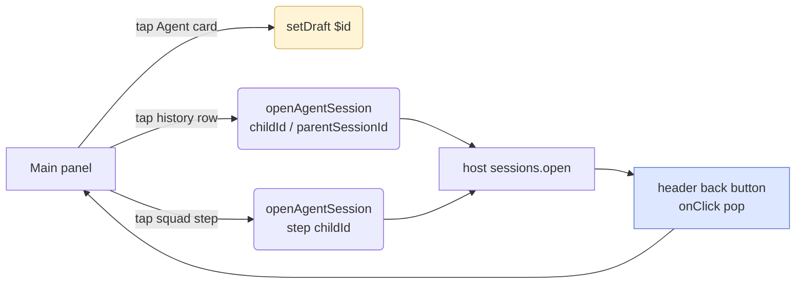
```mermaid
flowchart LR
    A[Main panel] -->|tap Agent card| B(setDraft $id)
    A -->|tap history row| C(openAgentSession<br/>childId / parentSessionId)
    A -->|tap squad step| D(openAgentSession<br/>step childId)
    C --> E[host sessions.open]
    D --> E
    E --> F[header back button<br/>onClick pop]
    F --> A
    style B fill:#fff5d6,stroke:#d6b15b
    style F fill:#dde7ff,stroke:#5b7bd6
```

## Design tradeoffs

- **Zero `@deepseek-ai/dsh-tools` dependency** (avoids official dual-instance bug #1697/#783): tools register via `ctx.tools.register` bare-object minimal shape.
- **No task scheduler reinvention**: continuation / persistence / follow-up reuse the host `ctx.subagents`; this plugin only adds "agent definition + routing + failover + audit".
- **No state-machine library**: state diagrams (squad orchestration) use host-native Promise.all + topological layering.
- **CSS variables map fully to DSH semantic tokens** (`--dsw-alias-*` / `--dsw-static-*`), light/dark auto-follow, no hardcoded `#RRGGBB`.
- **Switch/radio/slider unified two-state look** (gray track + white knob, position distinguishes state).

## Relationship with similar plugins

| Plugin | Difference |
| --- | --- |
| `dsh-agent-teams` etc. | `agent_*` tool prefix doesn't collide, but running two dispatch systems in one session creates redundant subagents — pick one. |
| `dsh-mnemon` | Memory system, no overlap. |
| `dsh-sentinel` | Background sentinel (file/port/process watch), no overlap. |
| `dsh-session-archive` | Session archive/search, no overlap. |

## Development

```sh
node verify.mjs   # consistency assertions + smoke (200+ hard rules)
```

Covers: package-name consistency, `dsh.client.platform:"web"`, `__ModuleLoader__.load` classic script, tabs / FAB / history / squad graph / edit modal invariants.

## Roadmap

- **v1.2**: token metering, agent-level `toolFilter`, agent command panel.
- **v1.3**: streaming progress for squad parallel steps.
- **v2.0**: dsh-mnemon integration — cross-session knowledge inheritance.

## License

MIT
