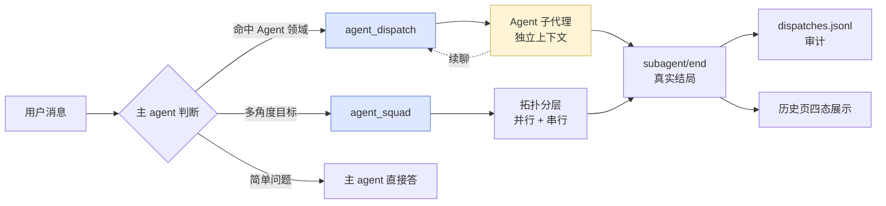
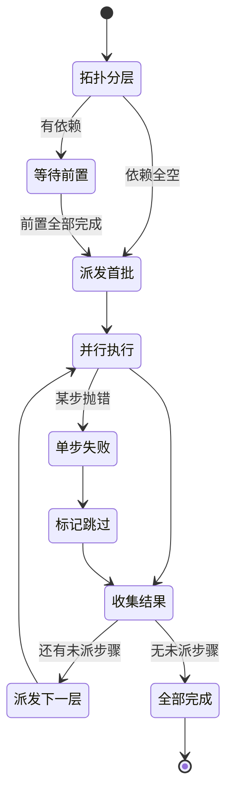
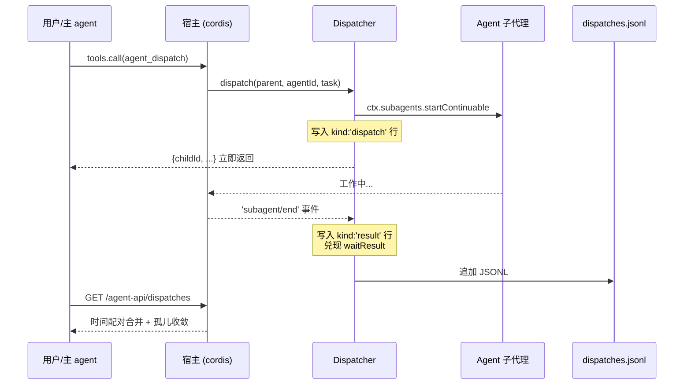
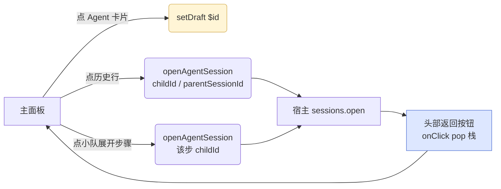

# dsh-agent-dispatch

[](https://github.com/kiligzzz/dsh-agent-dispatch/actions/workflows/ci.yml)

> DeepSeek Harness 插件 · 自定义 Agent + 自动路由 + 小队编排
>
> [English](README.en.md) | **简体中文**

你只说一句话，主 agent 按任务领域自动委派给带固定人设、独立上下文、可续聊的 Agent 子代理；Agent 模型按优先级表路由，失败自动换下一个；多角度目标可走小队模板（依赖前置结果自动代入）。

主面板挂到宿主原生右 tab「Agent 调度」，右下角常驻悬浮活动球，一键呼出运行中 / 最近完成 / Agent 列表 / 小队列表。

**无内置 Agent / 小队**：装好即空，全部由你自定义——面板「+ 新建」表单、从 `~/.dsh/skills` 一键导入、或直接编辑 `agents.json`。

## 截图速览

### 悬浮活动球

| 空闲 1 | 空闲 2 | 运行中 | 完成 |
| --- | --- | --- | --- |
|  |  |  |  |

| 弹窗（运行中） | 弹窗（Agent + 小队） | 悬浮球设置 |
| --- | --- | --- |
|  |  |  |

### 主面板（宿主右 tab「Agent 调度」）

| 总览 | Agent | 小队 | 历史 |
| --- | --- | --- | --- |
|  |  |  |  |

## 5 个模型工具

| 工具 | 用途 |
| --- | --- |
| `agent_dispatch(agentId, task)` | 把自包含任务委派给 Agent，返回 childId，结果以子代理通知回主线 |
| `agent_followup(childId, message)` | 对已有 Agent 追问（上下文延续） |
| `agent_list()` | 列 Agent 目录（id/适用域/路由），路由判断不确定时先查 |
| `agent_squad(squad_id, goal)` | 按小队模板展开目标，依赖前置结果自动代入 |
| `agent_import_skill(skillDir?)` | 把 `~/.dsh/skills/<name>/SKILL.md` 一键导入为 Agent |

## 怎么用

### 1. 先建 Agent

插件装好是空的，先定义你的 Agent：

- **面板建**：主面板「Agent」tab →「+ 新建 Agent」→ 填 id / 名称 / 触发域 / 系统提示词 / 模型路由。
- **从 skill 导入**：`agent_import_skill("my-skill")`，把 `~/.dsh/skills/<name>/SKILL.md` 正文当 persona、description 当触发域。不带参数先 `agent_import_skill()` 列出可导入的 skill。
- **直接写文件**：编辑 `$DSH_HOME/data/dsh-agent-dispatch/agents.json`（格式见下方「配置」）。

### 2. 三种触发方式

1. **对话自动路由**：任务命中某 Agent 的 `triggers`，主 agent 自动调 `agent_dispatch` 委派，而不是自己在主对话里做。
2. **`/` 触发器菜单**：输入 `/` 唤起候选菜单（含 Agent + 小队两组），选中插入 `$id `，主 agent 识别为显式指定委派。
3. **悬浮活动球**：点球展开面板 → 点 Agent/小队卡片 → 自动把 `$id ` 填入输入框，回车即委派。

### 3. 显式指定（`$` 前缀）

用户消息以 `$<id> ` 开头（如 `$log-tracer 查下 orders 慢查询`），主 agent 把后续文本作为 task 直接 `agent_dispatch` 给该 id 的 Agent（小队 id 用 `agent_squad`），不追问不改派。

### 4. 追问与续聊（同角色子代理智能复用）

同一 Agent 的后续任务由 `agent_dispatch` **智能决定**复用还是新开（v1.5.1，默认 `reuse:"auto"`）：

- **渐进延续**（续写标记词：继续/接着/追加/补充/在此基础上/continue/follow-up…，或涉及相同文件/术语）→ 复用对应子代理（`send_message` 续聊，上下文延续，不重复冷启动）；
- **独立新任务**（新领域、新文件、无延续关系）→ **自动新开子代理**，避免旧上下文污染与 token 膨胀；
- **指定线程续聊**（v1.5.3）：要复用的不是最近一个子代理、而是隔开的旧线程时——先 `agent_children` 查到该线程的 `childId`（附最近任务标签与 running/idle/ready 状态），再 `agent_dispatch(agentId, task, childId=...)` 定向续聊。**续聊只认 session id**：子代理进程/驻留是新是旧、是否已被空闲回收，都不影响续聊（持久会话冷恢复自动）。跨会话不可续（宿主强制相邻关系）。
- 你明确知道是续聊时传 `reuse:"reuse"` 强制复用最近同角色 child，明确是新任务时传 `reuse:"fresh"` 强制新开；也可以手动 `agent_followup(childId, message)` 指定子代理追问。

复用池为多线程 LRU（每 Agent 保留最近 3 个 child），不同任务线程的续聊各自命中正确的子代理，不互串。

**不再复用的子代理如何回收**：

- **进程内 spawn 子代理**（默认）：无 OS 进程——宿主在每轮结束后自动释放驻留（子代理降为 `ready`），插件另有 `idleReleaseMs`（默认 10 分钟）定时释放安全网；仅持久会话文件留在磁盘（宿主无删除 API）。
- **ACP 子代理**（deveco 等）：后台进程由 `dsh-plugin-product-subagents` 管理——每轮结束启动 `idleTimeoutMs`（默认 10 分钟）倒计时，超时未复用即 SIGTERM 回收进程；复用会取消倒计时；进程死后远端会话可经注册表/日志 marker 重连，连续性不丢。
- **显式关闭**：确认某条线程不再继续时，主模型可调 `agent_close`（`childId` 关指定子代理 / `agentId` 关该 Agent 全部闲置子代理）——立即停止复用并释放驻留资源；运行中的不打断，结束即自然回收。ACP 进程仍由 idle 定时器收尾，无需手动杀进程。

- **空闲回收**：子代理完成一轮后，空闲超过 `idleReleaseMs`（默认 10 分钟）会自动释放其驻留资源（`drainContinuableChildren`，内存/注册表槽位回收）；持久会话保留，下次复用自动冷恢复，上下文不丢。
- **探索型角色**：把 Agent 的 `reusePolicy` 设为 `fresh`（GUI 表单「子代理复用策略」），则 auto 模式下每次委派都独立新开子代理——适合探索/调研类任务，避免旧探索上下文污染新任务。
- 小队步骤（`agent_squad`）始终使用专属子代理（并发安全，不受复用策略影响）。

### 5. 多角度 / 流水线（小队）

既要分析又要审查、多路排查同一问题时，先建小队模板（面板「小队」tab），再 `agent_squad(squad_id, goal)`。步骤支持依赖：`dependsOn` 空 = 首批并行，否则等前置步骤结果代入（`{prev:N}` 占位符）。

## 委派 / 触发方式



## 小队编排状态机



## 生命周期与数据通道



- **写入**：`dispatch` 立即返回 childId；宿主 `subagent/end` 事件触发 `onChildEnd` 补真实结局（stopReason / lastAssistantMessage）。
- **合并**：`mergeDispatchHistory` 按 childId 时间正序配对 `kind:'dispatch'` ↔ `kind:'result'` 行；不在活体活跃映射的未终结行收敛为 `orphan:true`（状态未知）。
- **日志轮转**：`dispatches.jsonl` 上限 2000 行，超出自动重写保留尾部。
- **复用与回收**（v1.5.0）：`reusePolicy='reuse'` 的 Agent 在 `(父会话, Agent)` 维度维护复用池——完成一轮的子代理留在池中，后续委派直接 `send_message`（驻留 steer / 已释放冷恢复）；空闲 `idleReleaseMs`（默认 10 分钟，可配置 `idleReleaseMs` 或环境变量 `DSH_AGENT_DISPATCH_IDLE_RELEASE_MS`）后调用宿主 `drainContinuableChildren` 释放驻留资源。父会话结束 / 插件卸载时清理池状态。

## 安装

### GitHub 一键装

```sh
dsh plugin --profile <你的 profile 名> add github:kiligzzz/dsh-agent-dispatch
```

### 本地源码 link

```sh
dsh plugin --profile <你的 profile 名> add /path/to/dsh-agent-dispatch
```

### 数据目录

注册表 + 日志统一存：

```
$DSH_HOME/data/dsh-agent-dispatch/
├── agents.json      # Agent 列表
├── squads.json      # 小队列表
├── fab-config.json  # 悬浮球配置（隐藏状态/位置/显示模式/光效设置）
└── dispatches.jsonl # 决策日志（最多 2000 行自动轮转）
```

`$DSH_HOME` 缺省 `~/.dsh`。

## 配置

### Agent（`agents.json`）

```json
{
  "version": 1,
  "agents": [
    {
      "id": "log-tracer",
      "name": "线上排查员",
      "emoji": "🛠️",
      "triggers": "报错日志；订单异常；接口报错；线上问题排查",
      "systemPrompt": "……（完整 Agent 系统提示词 / persona）",
      "routes": [
        { "provider": "deepseek-official", "model": "deepseek-v4", "effort": "high" },
        { "provider": "kimi-coding", "model": "k3-256k", "effort": "high" }
      ],
      "reusePolicy": "reuse",
      "enabled": true
    }
  ]
}
```

- `routes`：模型优先级表，首个失败自动换下一个；留空继承主会话当前模型。
- `effort`：`minimal/low/medium/high/xhigh/max`（xhigh/max 底层钳到 high）。
- `reusePolicy`（v1.5.0；v1.5.1 起 `reuse` 为智能复用）：`reuse`（默认）= auto 智能判断——延续上一任务（续写词/相同文件术语）时复用同一子代理，独立新任务自动新开（`agent_dispatch` 可用 `reuse:"reuse"/"fresh"` 显式覆盖）；`fresh` = 每次委派独立新开子代理（适合探索型角色）。省略/缺省按 `reuse`。
- 改动保存即生效，**免重启**（下一轮对话即生效）。

### 小队（`squads.json`）

```json
{
  "version": 1,
  "squads": [
    {
      "id": "my-squad",
      "name": "我的小队",
      "emoji": "",
      "description": "示例",
      "enabled": true,
      "steps": [
        { "agentId": "log-tracer",   "phase": "日志", "dependsOn": [], "instruction": "{input}" },
        { "agentId": "sql-analyst",  "phase": "数据", "dependsOn": [], "instruction": "查表核对：\n{input}" },
        { "agentId": "code-reviewer", "phase": "审查", "dependsOn": [0, 1], "instruction": "基于日志+数据：\n{input}\n\n【日志结论】\n{prev:0}\n\n【数据结论】\n{prev:1}" }
      ]
    }
  ]
}
```

- `dependsOn` 为步骤下标数组，空数组 = 首批并行。
- `instruction` 支持两个占位符：`{input}`（用户目标全文）和 `{prev:N}`（第 N 步结果摘要）。
- 校验规则（与 `agent_squad` 工具相同）：下标越界/自指/非数组单独报错，存在循环依赖报「依赖环」。

## UI 全景

### 主面板 4 子 tab

| 子 tab | 内容 |
| --- | --- |
| **总览** | 顶部设置卡（显示悬浮球 / 默认模型 / 数据目录 / 触发方式）+ 统计卡（Agent 数 / 小队数 / 成功率 / 近 24h）+ 运行中列表 + Agent 使用排行 + 最近完成 |
| **Agent** | 用户自定义 Agent；卡片网格；点整卡进编辑弹窗；启停走开关 |
| **小队** | 用户自定义小队；卡片网格；点整卡进编辑弹窗；卡片内置执行流 SVG 缩略图；点图放大 |
| **历史** | Agent / 小队分段切换；Agent 行按时间排，小队行聚合一次运行；展开区含执行流图（节点状态着色）+ 任务详情 + 跳转按钮 |

### 悬浮活动球

- **位置**：默认右下角，可任意拖动（不吸附边缘）。
- **持久化**（v1.6.0）：隐藏状态 / 位置 / 光效设置落宿主数据目录 `fab-config.json`（经 `/agent-api/fab-config` 读写），跨 VS Code 重启 / webview 重建 / 端口回退可恢复；宿主通道不可用时回退 `localStorage`（key `ad-fab-*`），已有 `localStorage` 存量配置自动上载一次。多端（如浏览器 + VS Code 面板）共享同一 `$DSH_HOME` 时，同字段并发写为 last-writer-wins（settings 浅合并同理，后写端的未提及键不丢）。
- **光效**：8 种色调（雪白/品牌蓝/天蓝/雾紫/樱粉/杏橙/彩色渐变/毛玻璃），边缘流光，呼吸动效（`fab-live` 白光 / `done-glow` 彩光），面板透明度 0-100。
- **总开关**：主面板「总览」顶部「显示悬浮球」开关，off 强制隐藏。
- **弹窗**：从球心弹出，四分区卡片化（运行中 / 最近完成 / Agent 列表 / 小队列表），点整卡就地委派或跳子 Agent 会话。

### 会话头部返回按钮

挂宿主 `conversation.session.header.actions` 槽（id `agent-dispatch-back`，order 10）。导航栈记录每次跳转前的会话标题（上限 20 层），点返回依次弹出。导航栈空时按钮不渲染。

### 跳转链路



## 设计取舍

- **零 `@deepseek-ai/dsh-tools` 依赖**（规避官方双实例 bug #1697/#783）：工具注册走 `ctx.tools.register` 裸对象最小形状。
- **不重新发明任务调度**：可续聊 / 持久化 / 续问全部复用宿主 `ctx.subagents`；本插件只做"Agent 定义 + 路由策略 + 互备 + 审计"。
- **不引入状态机库**：状态图（如小队编排）用宿主原生 Promise.all + 拓扑分层实现，零额外依赖。
- **CSS 变量层全映射 DSH 语义化 token**（`--dsw-alias-*` / `--dsw-static-*`），亮/暗主题自动跟随，禁写死 `#RRGGBB`。
- **开关/单选/滑杆统一两态外观**（灰底 + 白圆球，位置区分），禁彩色/亮暗反转区分状态。

## 与同类插件关系

| 插件 | 区别 |
| --- | --- |
| `dsh-agent-teams` 等队长式插件 | 工具名 `agent_*` 前缀不冲突，但同会话同时用两套委派体系会产生冗余子代理，**建议单用**。 |
| `dsh-mnemon` | 记忆系统，无重叠。 |
| `dsh-sentinel` | 后台哨兵（文件/端口/进程 watch），无重叠。 |
| `dsh-session-archive` | 会话归档/搜索，无重叠。 |

## 开发

```sh
node verify.mjs   # 一致性断言 + 冒烟（必跑：覆盖 200+ 项硬规则）
```

校验覆盖：包名全链路一致、`dsh.client.platform:"web"` 必填、`__ModuleLoader__.load` 必 classic script、各子 tab / 悬浮球 / 历史 / 小队图 / 编辑弹窗 等视觉与行为不变量。

## 路线图

- **v1.2**：token 计量、Agent 级 `toolFilter`（限制可调工具集）、Agent 命令面板。
- **v1.3**：小队并行步骤的流式进度回显。
- **v2.0**：与 dsh-mnemon 联动 — 跨会话知识继承（Agent 子代理可读主会话历史记忆）。

## 许可

MIT
