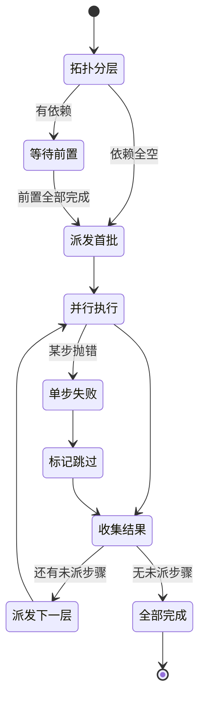
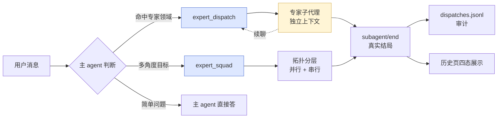
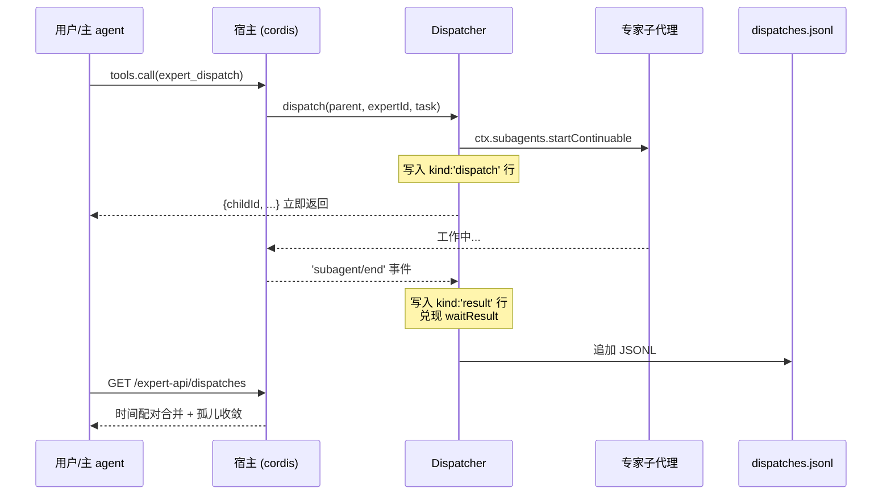
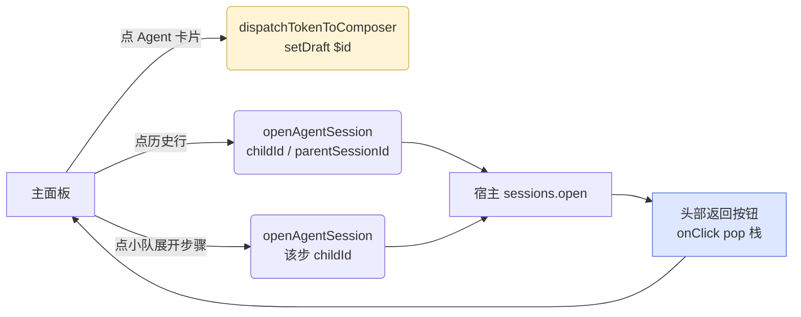

# dsh-agent-dispatch

> DeepSeek Harness 插件 · 预置专家 agent + 自动路由 + 小队编排
>
> [English](README.en.md) | **简体中文**

你只说一句话，主 agent 按任务领域自动委派给带固定人设、独立上下文、可续聊的专家子代理；专家模型按优先级表路由，失败自动换下一个；多角度目标可走小队模板（需求→审查串行 / 三路排查并行 / 双路审查并行），依赖前置结果自动代入。

主面板挂到宿主原生右 tab「Agent 调度」，右下角常驻悬浮活动球，一键呼出运行中 / 最近完成 / Agent 列表 / 小队列表。

## 截图速览

| 入口 | 视图 |
| --- | --- |
| 主面板「总览」子页（运行中 + 成功率 + Agent 排行 + 最近完成） | 见仓库 `docs/screenshots/overview.png` |
| 主面板「Agent」子页（4 个内置 + 用户扩展，卡片网格） | 见仓库 `docs/screenshots/agents.png` |
| 主面板「小队」子页（执行流图 + 步骤依赖拓扑） | 见仓库 `docs/screenshots/squads.png` |
| 主面板「历史」子页（Agent/小队分段，任务详情展开） | 见仓库 `docs/screenshots/history.png` |
| 悬浮活动球（拖动 + 弹窗 + 活跃呼吸光效） | 见仓库 `docs/screenshots/fab.png` |
| 悬浮球弹窗「最近完成」分区 | 见仓库 `docs/screenshots/fab-popup.png` |

> 你可以自行克隆本仓库跑出真实截图，本 README 内嵌图位留给后续 issue 补充。

## 5 个模型工具

| 工具 | 用途 |
| --- | --- |
| `expert_dispatch(expertId, task)` | 把自包含任务委派给专家，返回 childId，结果以子代理通知回主线 |
| `expert_followup(childId, message)` | 对已有专家追问（上下文延续） |
| `expert_list()` | 列专家目录（id/适用域/路由），路由判断不确定时先查 |
| `expert_squad(squad_id, goal)` | 按预置小队模板展开目标，依赖前置结果自动代入 |
| `expert_import_skill(skillDir?)` | 把 `~/.dsh/skills/<name>/SKILL.md` 一键导入为专家 |

## 4 个内置专家

| 专家 | id | 适用域 |
| --- | --- | --- |
| 需求分析师 | `requirement-analyst` | PRD 提炼、后端功能点清单、边界条件、待确认问题 |
| 代码审查员 | `code-reviewer` | 多维度代码 review（业务/规范/事务/数据/异常/接口/性能），问题分级 |
| 线上排查员 | `log-tracer` | 报错日志、订单号、接口异常 → 时间线 + 调用链 + 假设清单 |
| SQL 分析师 | `sql-analyst` | 查表结构、写查询、数据核对、性能分析（默认只读） |

头像显示规则：自定义 emoji → 名称首字 mono 头像 → DSH 官方 logo（兜底）。

## 3 个内置小队

| 小队 | 结构 | 适用 |
| --- | --- | --- |
| `dev-pipeline` | 需求分析 → 代码审查（串行，前置结论代入后步） | 改完一轮提交评审 |
| `debug-squad` | 日志排查 + SQL 核查 + 代码审查（三路并行） | 线上问题三路同时收 |
| `review-squad` | 业务审查 + 数据审查（双路并行） | 既要审业务又要审数据 |

小队编排状态机：



## 委派 / 触发方式



3 种触发入口：

1. **对话自动路由**：任务命中专家 triggers，主 agent 按内置策略 prompt section 自动调 `expert_dispatch`。
2. **`/` 触发器菜单**：输入 `/` 唤起候选菜单（命令组后多一个 `Agent` 组，含 Agent + 小队），选中插入 `$id `，模型按策略第 8 条识别为指定委派。
3. **悬浮活动球**：点球展开面板 → 选 Agent/小队卡片 → 走 `conversation.input.shell.setDraft("$id ")` 一键填入输入框。

> 用户消息以 `$<id> ` 开头时（如 `$sql-analyst 查下 orders 慢查询`），主 agent 把后续文本作为 task 直接 `expert_dispatch` 给该 id 的 Agent（小队 id 用 `expert_squad`），不追问不改派。`$` 前缀来自输入框 `/` 菜单插入或用户手打。

## 生命周期与数据通道



- **写入**：`dispatch` 立即返回 childId；宿主 `subagent/end` 事件触发 `onChildEnd` 补真实结局（stopReason / lastAssistantMessage）。
- **合并**：`mergeDispatchHistory` 按 childId 时间正序配对 `kind:'dispatch'` ↔ `kind:'result'` 行；不在活体活跃映射的未终结行收敛为 `orphan:true`（状态未知）。
- **日志轮转**：`dispatches.jsonl` 上限 2000 行，超出自动重写保留尾部。

## 安装

### GitHub 一键装

```sh
dsh plugin --profile <你的 profile 名> add github:kiligzzz/dsh-agent-dispatch
# 等价 npm tag（次要）：dsh plugin --profile <X> add @kiligzzz/dsh-agent-dispatch@1.0.0
```

### 本地源码 link

```sh
dsh plugin --profile <你的 profile 名> add /Users/ivan/dsh/plugins/dsh-agent-dispatch
```

### 数据目录

注册表 + 日志统一存：

```
$DSH_HOME/data/dsh-agent-dispatch/
├── experts.json     # 专家列表（含 deletedIds 持久标记）
├── squads.json      # 小队列表
└── dispatches.jsonl # 决策日志（最多 2000 行自动轮转）
```

`$DSH_HOME` 缺省 `~/.dsh`。

## 配置

### 专家（`experts.json`）

```json
{
  "version": 1,
  "deletedIds": [],
  "experts": [
    {
      "id": "log-tracer",
      "name": "线上排查员",
      "emoji": "🛠️",
      "triggers": "报错日志；订单异常；接口报错；线上问题排查",
      "systemPrompt": "……（完整专家系统提示词）",
      "routes": [
        { "provider": "deepseek-official", "model": "deepseek-v4", "effort": "high" },
        { "provider": "kimi-coding", "model": "k3-256k", "effort": "high" }
      ],
      "enabled": true
    }
  ]
}
```

- `routes`：模型优先级表，首个失败自动换下一个；留空继承主会话当前模型。
- `effort`：`minimal/low/medium/high/xhigh/max`（xhigh/max 底层钳到 high）。
- 删除内置专家后不会在重启时复活（`deletedIds` 持久标记；重新 `upsert` 同名 id 视为恢复）。
- 改动保存即生效，**免重启**（下一轮对话即生效）。

### 小队（`squads.json`）

```json
{
  "version": 1,
  "deletedIds": [],
  "squads": [
    {
      "id": "my-squad",
      "name": "我的小队",
      "emoji": "",
      "description": "示例",
      "enabled": true,
      "steps": [
        { "expertId": "log-tracer",   "phase": "日志", "dependsOn": [], "instruction": "{input}" },
        { "expertId": "sql-analyst",  "phase": "数据", "dependsOn": [], "instruction": "查表核对：\n{input}" },
        { "expertId": "code-reviewer", "phase": "审查", "dependsOn": [0, 1], "instruction": "基于日志+数据：\n{input}\n\n【日志结论】\n{prev:0}\n\n【数据结论】\n{prev:1}" }
      ]
    }
  ]
}
```

- `dependsOn` 为步骤下标数组，空数组 = 首批并行。
- `instruction` 支持两个占位符：`{input}`（用户目标全文）和 `{prev:N}`（第 N 步结果摘要）。
- 校验规则（与 `expert_squad` 工具相同）：下标越界/自指/非数组单独报错，存在循环依赖报「依赖环」。

## UI 全景

### 主面板 4 子 tab

| 子 tab | 内容 |
| --- | --- |
| **总览** | 顶部设置卡（显示悬浮球 / 默认模型 / 数据目录 / 触发方式）+ 统计卡（Agent 数 / 小队数 / 成功率 / 近 24h）+ 运行中列表 + Agent 使用排行（条形图） + 最近完成 |
| **Agent** | 4 内置 + 用户扩展；卡片网格，一行 4 个（窄面板自动降单列）；点整卡进编辑弹窗；启停走单选 + 开关 |
| **小队** | 3 内置 + 用户扩展；卡片网格，一行 2 个；点整卡进编辑弹窗；卡片内置执行流 SVG 缩略图；点图放大进弹窗 |
| **历史** | Agent / 小队分段切换；Agent 行按时间排，小队行聚合一次运行；展开区含执行流图（节点状态着色 + 步骤明细）+ 任务详情 + 跳转按钮 |

### 悬浮活动球

- **位置**：默认右下角 60×60，可任意拖动（不吸附边缘），位置存 `localStorage`（key `ad-fab-pos`）。
- **光效**：8 种色调（雪白/天蓝/毛玻璃/樱粉/玫瑰/雾紫/紫罗兰/彩虹），8 段边缘流光（独立环 `ad-fab-edge-ring`），呼吸动效类（`ad-fab-breathe` / `fab-live` 白光 / `done-glow` 彩光），透明度 0-100。
- **总开关**：主面板「总览」顶部「显示悬浮球」开关，off 强制隐藏，优先级高于显示模式（always/auto/never）。
- **弹窗**：340px 宽，从球心弹出（`transform-origin` 指向球心），四分区卡片化（运行中 / 最近完成 / Agent 列表 / 小队列表），点整卡走 `dispatchTokenToComposer` 就地调用或 `openAgentSession` 跳子 agent 会话。

### 会话头部返回按钮

挂宿主 `conversation.session.header.actions` 槽（id `agent-dispatch-back`，order 10）。导航栈记录每次跳转前的会话标题（上限 20 层），点返回依次弹出。导航栈空时按钮不渲染（不占位）。

### 跳转链路



## 设计取舍

- **零 `@deepseek-ai/dsh-tools` 依赖**（规避官方双实例 bug #1697/#783）：工具注册走 `ctx.tools.register` 裸对象最小形状。
- **不重新发明任务调度**：可续聊 / 持久化 / 续问全部复用宿主 `ctx.subagents`；本插件只做"专家定义 + 路由策略 + 互备 + 审计"。
- **不引入状态机库**：状态图（如小队编排）用宿主原生 Promise.all + 拓扑分层实现，零额外依赖。
- **CSS 变量层全映射 DSH 语义化 token**（`--dsw-alias-*` / `--dsw-static-*`），亮/暗主题自动跟随，禁写死 `#RRGGBB`。
- **开关/单选/滑杆统一两态外观**（灰底 + 白圆球，位置区分），禁彩色/亮暗反转区分状态——所有 DSH 插件通用偏好。

## 与同类插件关系

| 插件 | 区别 |
| --- | --- |
| `dsh-agent-teams` 等队长式插件 | 工具名 `expert_*` 前缀不冲突，但同会话同时用两套委派体系会产生冗余子代理，**建议单用**。 |
| `dsh-mnemon` | 记忆系统，无重叠。 |
| `dsh-sentinel` | 后台哨兵（文件/端口/进程 watch），无重叠。 |
| `dsh-session-archive` | 会话归档/搜索，无重叠。 |

## 开发

```sh
node verify.mjs   # 一致性断言 + 冒烟（必跑：覆盖了 200+ 项硬规则）
```

校验覆盖：包名全链路六处一致、`dsh.client.platform:"web"` 必填、`__ModuleLoader__.load` 必 classic script、id 必裸包名、各子 tab / 悬浮球 / 历史 / 小队图 / 编辑弹窗 等视觉与行为不变量。

## 路线图

- **v1.1**：token 计量、专家级 `toolFilter`（限制可调工具集）、`/expert` 风格的 Agent 命令面板。
- **v1.2**：小队并行步骤的流式进度回显（v0.9.36 起步，v1.2 完成）。
- **v2.0**：与 dsh-mnemon 联动 — 跨会话知识继承（专家子代理可读主会话历史记忆）。

## 许可

MIT
