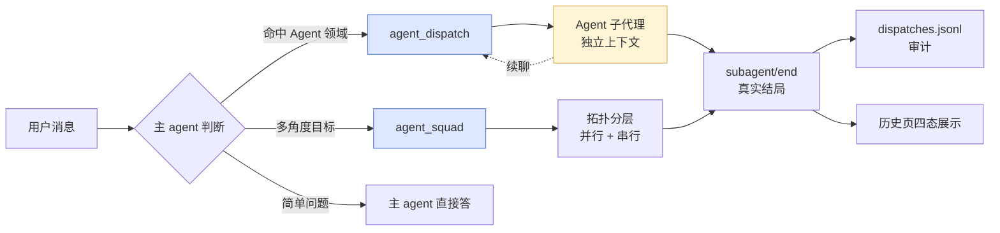
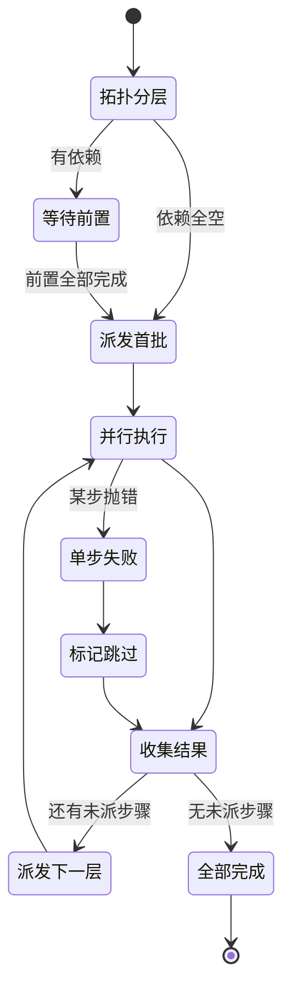
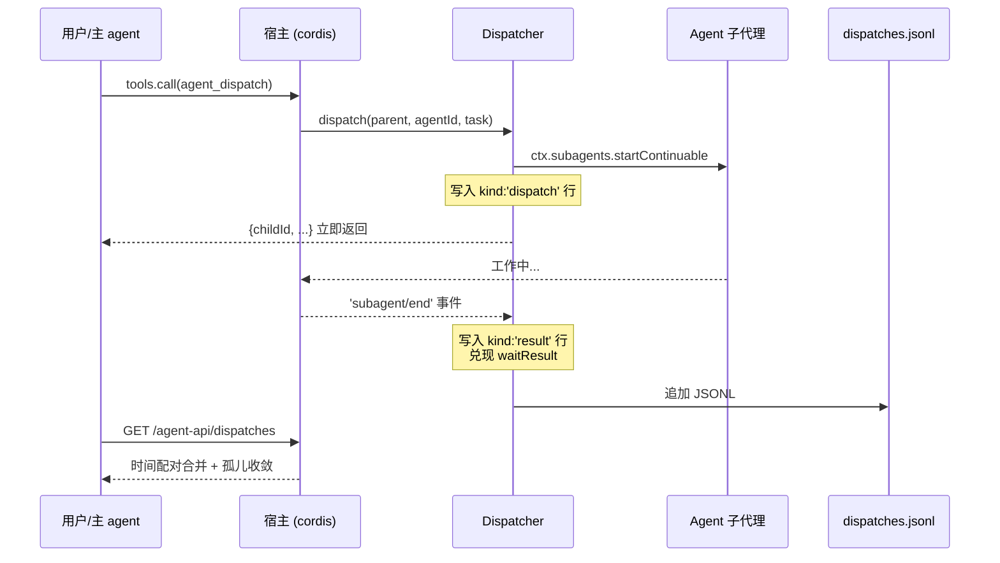
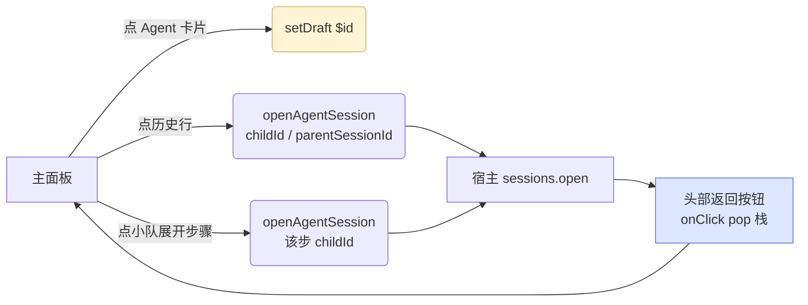

# dsh-agent-dispatch

[](https://github.com/kiligzzz/dsh-agent-dispatch/actions/workflows/ci.yml)

> DeepSeek Harness 插件 · 自定义 Agent + 自动路由 + 小队编排
>
> [English](README.en.md) | **简体中文**

你只说一句话，主 agent 按任务领域自动委派给带固定人设、独立上下文、可续聊的 Agent 子代理；Agent 模型按优先级表路由，失败自动换下一个；多角度目标可走小队模板（依赖前置结果自动代入）。

主面板挂到宿主原生右 tab「Agent 调度」，右下角常驻悬浮活动球，一键呼出运行中 / 最近完成 / Agent 列表 / 小队列表。

**无内置 Agent / 小队**：装好即空，全部由你自定义——面板「+ 新建」表单、从 `~/.dsh/skills` 一键导入、或直接编辑 `agents.json`。

## 截图速览

### 悬浮活动球

| 空闲 1 | 空闲 2 | 运行中 | 完成 |
| --- | --- | --- | --- |
|  |  |  |  |

| 弹窗（运行中） | 弹窗（Agent + 小队） | 悬浮球设置 |
| --- | --- | --- |
|  |  |  |

### 主面板（宿主右 tab「Agent 调度」）

| 总览 | Agent | 小队 | 历史 |
| --- | --- | --- | --- |
|  |  |  |  |

## 5 个模型工具

| 工具 | 用途 |
| --- | --- |
| `agent_dispatch(agentId, task)` | 把自包含任务委派给 Agent，返回 childId，结果以子代理通知回主线 |
| `agent_followup(childId, message)` | 对已有 Agent 追问（上下文延续） |
| `agent_list()` | 列 Agent 目录（id/适用域/路由），路由判断不确定时先查 |
| `agent_squad(squad_id, goal)` | 按小队模板展开目标，依赖前置结果自动代入 |
| `agent_import_skill(skillDir?)` | 把 `~/.dsh/skills/<name>/SKILL.md` 一键导入为 Agent |
| 把某个**正在等待换档决定**的失败档换到下一档 routes 档位（替补档成为你的直接子级，可双向对话） |

## 怎么用

### 1. 先建 Agent

插件装好是空的，先定义你的 Agent：

- **面板建**：主面板「Agent」tab →「+ 新建 Agent」→ 填 id / 名称 / 触发域 / 系统提示词 / 模型路由。
- **从 skill 导入**：`agent_import_skill("my-skill")`，把 `~/.dsh/skills/<name>/SKILL.md` 正文当 persona、description 当触发域。不带参数先 `agent_import_skill()` 列出可导入的 skill。
- **直接写文件**：编辑 `$DSH_HOME/data/dsh-agent-dispatch/agents.json`（格式见下方「配置」）。

### 2. 三种触发方式

1. **对话自动路由**：任务命中某 Agent 的 `triggers`，主 agent 自动调 `agent_dispatch` 委派，而不是自己在主对话里做。
2. **`/` 触发器菜单**：输入 `/` 唤起候选菜单（含 Agent + 小队两组），选中插入 `$id `，主 agent 识别为显式指定委派。
3. **悬浮活动球**：点球展开面板 → 点 Agent/小队卡片 → 自动把 `$id ` 填入输入框，回车即委派。

### 3. 显式指定（`$` 前缀）

用户消息以 `$<id> ` 开头（如 `$log-tracer 查下 orders 慢查询`），主 agent 把后续文本作为 task 直接 `agent_dispatch` 给该 id 的 Agent（小队 id 用 `agent_squad`），不追问不改派。

### 4. 追问与续聊（同角色子代理智能复用）

同一 Agent 的后续任务由 `agent_dispatch` **智能决定**复用还是新开（v1.5.1，默认 `reuse:"auto"`）：

- **渐进延续**（续写标记词：继续/接着/追加/补充/在此基础上/continue/follow-up…，或涉及相同文件/术语）→ 复用对应子代理（`send_message` 续聊，上下文延续，不重复冷启动）；
- **独立新任务**（新领域、新文件、无延续关系）→ **自动新开子代理**，避免旧上下文污染与 token 膨胀；
- **指定线程续聊**（v1.5.3）：要复用的不是最近一个子代理、而是隔开的旧线程时——先 `agent_children` 查到该线程的 `childId`（附最近任务标签与 running/idle/ready 状态），再 `agent_dispatch(agentId, task, childId=...)` 定向续聊。**续聊只认 session id**：子代理进程/驻留是新是旧、是否已被空闲回收，都不影响续聊（持久会话冷恢复自动）。跨会话不可续（宿主强制相邻关系）。
- 你明确知道是续聊时传 `reuse:"reuse"` 强制复用最近同角色 child，明确是新任务时传 `reuse:"fresh"` 强制新开；也可以手动 `agent_followup(childId, message)` 指定子代理追问。

复用池为多线程 LRU（每 Agent 保留最近 3 个 child），不同任务线程的续聊各自命中正确的子代理，不互串。

**不再复用的子代理如何回收**：

- **进程内 spawn 子代理**（默认）：无 OS 进程——宿主在每轮结束后自动释放驻留（子代理降为 `ready`），插件另有 `idleReleaseMs`（默认 10 分钟）定时释放安全网；仅持久会话文件留在磁盘（宿主无删除 API）。
- **ACP 子代理**（deveco 等）：后台进程由 `dsh-plugin-product-subagents` 管理——每轮结束启动 `idleTimeoutMs`（默认 10 分钟）倒计时，超时未复用即 SIGTERM 回收进程；复用会取消倒计时；进程死后远端会话可经注册表/日志 marker 重连，连续性不丢。
- **显式关闭**：确认某条线程不再继续时，主模型可调 `agent_close`（`childId` 关指定子代理 / `agentId` 关该 Agent 全部闲置子代理）——立即停止复用并释放驻留资源；运行中的不打断，结束即自然回收。ACP 进程仍由 idle 定时器收尾，无需手动杀进程。

- **空闲回收**：子代理完成一轮后，空闲超过 `idleReleaseMs`（默认 10 分钟）会自动释放其驻留资源（`drainContinuableChildren`，内存/注册表槽位回收）；持久会话保留，下次复用自动冷恢复，上下文不丢。
- **探索型角色**：把 Agent 的 `reusePolicy` 设为 `fresh`（GUI 表单「子代理复用策略」），则 auto 模式下每次委派都独立新开子代理——适合探索/调研类任务，避免旧探索上下文污染新任务。
- 小队步骤（`agent_squad`）始终使用专属子代理（并发安全，不受复用策略影响）。

### 5. 多角度 / 流水线（小队）

既要分析又要审查、多路排查同一问题时，先建小队模板（面板「小队」tab），再 `agent_squad(squad_id, goal)`。步骤支持依赖：`dependsOn` 空 = 首批并行，否则等前置步骤结果代入（`{prev:N}` 占位符）。

## 委派 / 触发方式


```mermaid
flowchart LR
    A[用户消息] --> B{主 agent 判断}
    B -- 命中 Agent 领域 --> C[agent_dispatch]
    B -- 多角度目标 --> D[agent_squad]
    B -- 简单问题 --> E[主 agent 直接答]
    C --> F[Agent 子代理<br/>独立上下文]
    D --> G[拓扑分层<br/>并行 + 串行]
    F --> H[subagent/end<br/>真实结局]
    G --> H
    H --> I[dispatches.jsonl<br/>审计]
    H --> J[历史页四态展示]
    F -.续聊.-> C
    style C fill:#dde7ff,stroke:#5b7bd6
    style D fill:#dde7ff,stroke:#5b7bd6
    style F fill:#fff5d6,stroke:#d6b15b
```

## 小队编排状态机


```mermaid
stateDiagram-v2
    [*] --> 拓扑分层
    拓扑分层 --> 派发首批: 依赖全空
    拓扑分层 --> 等待前置: 有依赖
    等待前置 --> 派发首批: 前置全部完成
    派发首批 --> 并行执行
    并行执行 --> 收集结果
    收集结果 --> 派发下一层: 还有未派步骤
    收集结果 --> 全部完成: 无未派步骤
    派发下一层 --> 并行执行
    全部完成 --> [*]
    并行执行 --> 单步失败: 某步抛错
    单步失败 --> 标记跳过
    标记跳过 --> 收集结果
```

## 生命周期与数据通道


```mermaid
sequenceDiagram
    participant U as 用户/主 agent
    participant H as 宿主 (cordis)
    participant D as Dispatcher
    participant E as Agent 子代理
    participant L as dispatches.jsonl
    U->>H: tools.call(agent_dispatch)
    H->>D: dispatch(parent, agentId, task)
    D->>E: ctx.subagents.startContinuable
    Note over D: 写入 kind:'dispatch' 行
    D-->>U: {childId, ...} 立即返回
    E-->>H: 工作中...
    H-->>D: 'subagent/end' 事件
    Note over D: 写入 kind:'result' 行<br/>兑现 waitResult
    D->>L: 追加 JSONL
    U->>H: GET /agent-api/dispatches
    H-->>U: 时间配对合并 + 孤儿收敛
```

- **写入**：`dispatch` 立即返回 childId；宿主 `subagent/end` 事件触发 `onChildEnd` 补真实结局（stopReason / lastAssistantMessage）。
- **合并**：`mergeDispatchHistory` 按 childId 时间正序配对 `kind:'dispatch'` ↔ `kind:'result'` 行；不在活体活跃映射的未终结行收敛为 `orphan:true`（状态未知）。
- **日志轮转**：`dispatches.jsonl` 上限 2000 行，超出自动重写保留尾部。
- **复用与回收**（v1.5.0）：`reusePolicy='reuse'` 的 Agent 在 `(父会话, Agent)` 维度维护复用池——完成一轮的子代理留在池中，后续委派直接 `send_message`（驻留 steer / 已释放冷恢复）；空闲 `idleReleaseMs`（默认 10 分钟，可配置 `idleReleaseMs` 或环境变量 `DSH_AGENT_DISPATCH_IDLE_RELEASE_MS`）后调用宿主 `drainContinuableChildren` 释放驻留资源。父会话结束 / 插件卸载时清理池状态。

## 安装

### GitHub 一键装

```sh
dsh plugin --profile <你的 profile 名> add github:kiligzzz/dsh-agent-dispatch
```

### 本地源码 link

```sh
dsh plugin --profile <你的 profile 名> add /path/to/dsh-agent-dispatch
```

### 数据目录

注册表 + 日志统一存：

```
$DSH_HOME/data/dsh-agent-dispatch/
├── agents.json      # Agent 列表
├── squads.json      # 小队列表
├── fab-config.json  # 悬浮球配置（隐藏状态/位置/显示模式/光效设置）
└── dispatches.jsonl # 决策日志（最多 2000 行自动轮转）
```

`$DSH_HOME` 缺省 `~/.dsh`。

## 配置

### Agent（`agents.json`）

```json
{
  "version": 1,
  "agents": [
    {
      "id": "log-tracer",
      "name": "线上排查员",
      "emoji": "🛠️",
      "triggers": "报错日志；订单异常；接口报错；线上问题排查",
      "systemPrompt": "……（完整 Agent 系统提示词 / persona）",
      "routes": [
        { "provider": "deepseek-official", "model": "deepseek-v4", "effort": "high" },
        { "provider": "kimi-coding", "model": "k3-256k", "effort": "high" }
      ],
      "reusePolicy": "reuse",
      "enabled": true
    }
  ]
}
```

- `routes`：模型优先级表，首个失败自动换下一个；留空继承主会话当前模型。
- `provider` 两类（v1.11.12 起 GUI 表单同时可选，运行期按 `ctx.subagents.getProvider` 判定）：
  - **LLM 路由**（宿主 dsh-llm 适配器，如 `deepseek-official`）：`model` 必填；
  - **ACP 产品路由**（`dsh-plugin-product-subagents` 注册，如 `qoder`/`deveco`/`opencode`）：`model` 可省略或填 `default`，语义是"用产品自己的默认模型"。
- `effort`：取值域由该 provider/model 决定——LLM 侧来自适配器上报（`llm.resolveModelInfo().reasoning.efforts`），ACP 侧来自产品目录（`product-subagents` 的 `provider-catalog.json`）；留空 = 不指定，用模型/产品默认档位。面板下拉即按此动态生成，拿不到目录时退化为手输。
- 面板的「刷新 ACP 模型目录」向 `product-subagents` 发一条探测请求（立即返回，不等探测完成），完成后自动重取。ACP 目录未探测或探测失败时，该行的 model / effort 都是可手输输入框（附候选提示），不会把你锁死在下拉里。
- **下拉显示的是产品自报名，落盘的仍是可执行值**：产品目录除 `models`/`efforts` 外还可带 `modelOptions`/`effortOptions`/`modelEffortOptions`（`[{value,name?,description?}]`），选项文本用 `name`（没有就退回 `value`）、`description` 作悬停提示，但**写进 `agents.json` 的永远是 `value`**（也就是能直接喂给 ACP `session/set_config_option` 的那个字符串）。
- **填了不生效不会静默**：`model`/`effort` 写错（provider 对、值不在目录里）时任务照常跑——产品侧按自己的默认值继续，插件不会因此失败，也不会改写你的配置；面板会标「不在模型表中，可能不生效」，`data/dsh-agent-dispatch/dispatches.jsonl` 里该次派发记 `configNote`（可疑值）与 `effort` 字段，产品真正拒绝时另记一行 `kind:"config"`（`requested` 请求值 → `effective` 实际生效值，来自 `product-subagents/config-option-error` 事件；这类行不是一次委派，历史页不展示，供 grep 排障）。注意：配置变更只对**新开**的子代理线程生效，已驻留续聊的线程沿用其创建时的设置。
- `reusePolicy`（v1.5.0；v1.5.1 起 `reuse` 为智能复用）：`reuse`（默认）= auto 智能判断——延续上一任务（续写词/相同文件术语）时复用同一子代理，独立新任务自动新开（`agent_dispatch` 可用 `reuse:"reuse"/"fresh"` 显式覆盖）；`fresh` = 每次委派独立新开子代理（适合探索型角色）。省略/缺省按 `reuse`。
- 改动保存即生效，**免重启**（下一轮对话即生效）。

### 小队（`squads.json`）

```json
{
  "version": 1,
  "squads": [
    {
      "id": "my-squad",
      "name": "我的小队",
      "emoji": "",
      "description": "示例",
      "enabled": true,
      "steps": [
        { "agentId": "log-tracer",   "phase": "日志", "dependsOn": [], "instruction": "{input}" },
        { "agentId": "sql-analyst",  "phase": "数据", "dependsOn": [], "instruction": "查表核对：\n{input}" },
        { "agentId": "code-reviewer", "phase": "审查", "dependsOn": [0, 1], "instruction": "基于日志+数据：\n{input}\n\n【日志结论】\n{prev:0}\n\n【数据结论】\n{prev:1}" }
      ]
    }
  ]
}
```

- `dependsOn` 为步骤下标数组，空数组 = 首批并行。
- `instruction` 支持两个占位符：`{input}`（用户目标全文）和 `{prev:N}`（第 N 步结果摘要）。
- 校验规则（与 `agent_squad` 工具相同）：下标越界/自指/非数组单独报错，存在循环依赖报「依赖环」。

### 危险字样（危险命令门的全文判定，`dsh-danger-patterns.json`）

危险命令门除「按段 / 命令头 + 形状判据 + 结构判据」外，还有一层**全文子串判定**：
文本里出现下列字样（**任意位置**，含提交信息 / 注释 / 文档 / `grep` 参数）就会弹授权框。

- 路径：`$DSH_HOME/data/dsh-danger-patterns.json`（`$DSH_HOME` 缺省 `~/.dsh`；与
  `dsh-plugin-product-subagents` **共用同一个文件**）
- 预设（**恒生效，不可通过配置关闭**）：`rm -rf`、`git push`、`npm publish`
- schema（可带 `_readme` 之类注释字段）：

  ```json
  { "patterns": ["rm -rf", "git push", "npm publish", "kubectl delete ns"] }
  ```

- 语义（**配置只增不减**）：`patterns` 里的条目只是**追加**到预设三个之后；文件缺失 / 坏 JSON /
  `patterns` 不是数组 / `patterns: []` ⇒ 一律等价于「**没有追加项**」，预设三个照常生效
  —— **内置三串不可通过配置关闭**。理由：该文件在 `$DSH_HOME/data/` 下、任何能写它的命令都能改它，
  若允许「关闭」就等于给危险命令留了一条自我解除武装的路；而**增加**模式只会让门更严（更爱弹）。
  每条 `trim` + 折叠空白 + 丢空串 + 去重；**按字面匹配（不是正则）**，且带**词边界**
  （`perform -rf x`、`legit push`、`npm publisher` 这类不误伤）。
- **改完文件立即生效**（按 `mtime` + `size` + `mode` 变更重读），**不需要重装 / 重启宿主**。
- **规模与读取上限（v1.12.13；两仓统一）**：单条模式 ≤ **4096** 字符、追加条数 ≤ **1024** 条、
  配置文件读取 ≤ **1MiB**；超限的条目**按「没有追加项」处理**（预设三串照常生效），并**告警一次**。
  **该配置文件由两个插件共用**（本插件的宿主/原生通道 + `dsh-plugin-product-subagents` 的
  ACP/product 通道）——两仓的**路径 / schema / 只增不减语义 / 三档上限（1MiB / 4096 / 1024）
  完全一致**，避免同一份配置在两个门里行为不同。
  只读**普通文件**：`dsh-danger-patterns.json` 若是 FIFO / 指向 `/dev/zero` 之类的设备 / 目录，
  一律**跳过**（等价于没有追加项）—— 这条判定跑在每次审批的**同步**热路径上，不能让特殊文件把它挂死。
- **日志口径（v1.12.13）**：文件**缺失**是正常状态 ⇒ **静默**；坏 JSON / `patterns` 非数组 /
  非普通文件 / 超限才 `console.warn` **一次**（同一次进程内不重复刷）。
- 归因名：预设串 `text:<模式>`，自定义串 `text:custom:<原串>`（排障时看 `dispatches.jsonl` 的 `rule`）。
- **与 B 仓（ACP/product 通道）的容差差异（如实登记）**：本插件的模式容差类比 B 仓**多认「只有引号」的
  分隔符与反引号** ⇒ `rm"-rf"` / `rm'-rf'` / `` rm`-rf` `` / `git"push"` 在**本插件 HIT、B 仓 MISS**。
  按 `/bin/sh` 语义这些其实是 `rm-rf` / `gitpush`（shell 会把引号吃掉拼成一个词）⇒ **方向是多弹、不放行**
  （安全侧），本版**不缩**（缩容差 = 变松）。反引号那格更明显：`` r`m` -rf /tmp/x `` 在 shell 里是
  **命令替换**（不是 `rm`），本插件同样会弹 —— 同属**误报方向**，单独登记。
- 代价（**有意取舍**）：只是**提到**这些字样（提交信息、注释、文档、`git log --grep "git push"`）也会弹。
  本层**只做加法**：既有判定一条没删（结构判据、词法等价写法照旧）。
- **归一化（v1.12.13）**：判定前把文本做**多读** —— ① 新口径（真实换行 = 段分隔；字面 `\n`/`\r`
  两字符序列 = 该语言眼里的真换行 = 段分隔；字面 `\t` = 空格；折叠多余空白）；② **词内引号拼接**
  归一化（`r"m" -rf /tmp/x` ⇒ `rm -rf /tmp/x`；贴空白的引号原样保留）；③ **旧口径读**（= 1.12.11
  的读法：字面转义与**裸 CR** 都折空格）；④ 原文。四份**去重**后逐份判 ⇒ 任何一份命中即高危
  （多读**只能更容易命中**，不会把上一版会命中的形态变 MISS）。

## fallback 链（换档）与失败分级

Agent 的 `routes` 是一条有序的互备链。某一档失败时本插件会换下一档、用**同一份任务文本**重投，
而**替补档一律是主代理的直接子级**（depth-1 同级，不是失败档的孙代）——因此主代理可以直接
`send_message` 它、`agent_children` 看得见它、`interrupt_agent` interrupt 得动它。

> **同一任务在任何时刻至多只有一个替补子代理。** 手动换档与自动换档共用**同一个原子 claim**
> （`#claimHandoff` 的 `has → set → run` 同步块），未抢到者**幂等返回同一 `childId`**，
> 不会产生第二个替补。这不是「尽量避免」，是机制保证。

实现要点（v1.11.24）：

- **换档决定权归主代理**：失败档失败时向主代理发一条**唤醒型**信号（idle → `followup`、
  running → `steer`；`inject` 是 non-waking，主代理空闲时读不到），并暴露幂等工具
  **`agent_failover({ childId })`**。调用它会**终止并释放旧档（由插件兑现其阻塞等待），
  并派发下一档同级子代理**——主代理**不需要**额外单独调 `interrupt_agent`（宿主调度器即使
  abort 也会等 in-flight 工具 settle，`interrupt_agent` 解不开被阻塞的 `product_submit`；
  真正的释放是插件显式兑现那条 promise）。
  `notify-then-auto` 模式超时后**由插件执行同一套流程**。
- **工具只接受 childId**：原任务原文、agentId、失败档 provider、下一档 route、已试档列表、
  错误轨迹全部由编排层自查。现有 `agent_dispatch` 没有 provider/model 参数，主代理根本无法
  表达「换到哪一档」——所以必须新增一个专用工具。
- **通知顺序（新语义）**：① 唤醒型换档信号 → ② 失败档的
  `Background subagent <id> was stopped before it finished.` → ③ 替补档的结算通知。
  ② 由宿主 `notifySettlement` 无条件发出、**无法从插件侧抑制**，但它**晚于**显式信号且语义真实。
  释放顺序写死为 **interrupt 旧档 → 迁移 waiter → 派同级替补 → 兑现 rendezvous**，
  保证「旧档释放」永远晚于「替补存在」。
- **不双份换档**：失败档结束时 `onChildEnd` 仍会算「要不要自动换档」，三道闸门拦住它——
  `entry.inTurnChain`（持久，在**发信号之前**置位）、未决 rendezvous（瞬时）、
  `activeTasks` 活跃兄弟闸（替补已登记，是天然的双保险）。
- 最终失败报告**自解释**：`（步骤失败: …；已尝试 3 档: deveco → EMPTY_RESPONSE …；
  opencode → RATE_LIMITED …；deepseek-official → …；自动换档已停止: 当前已是最末档，无后续路由）`。
- 失败按等级分流（`failover` / `fatal` / `interrupted`，权威来源是 product-subagents 下发的
  `info.grade`）：限额/限流/空正文/超时/传输中断判 `failover`（静默换档）；认证失败、参数非法、
  语法错误、模型不存在、人为拒绝、链已耗尽判 `fatal`（**不换档**，重试也不会改善）；
  人为取消判 `interrupted`。未列出的错误兜底 `failover`——只有被明确归入 `fatal` 的才停止换档。
- **已换过档的失败档，回合结束后不会再原样重试一遍**（v1.11.23 起，v1.11.24 保留）。
  终止原因写明 `；自动换档已停止: 本回合内已由换档链路处理过（显式或超时自动），不重复重试`。
  没有这条闸时，主代理之下会同时存在「已派出的替补」与「回合外兄弟」两个跑同一任务的 child，
  即 1.11.22 修掉的那个事故的同形复发。
- **需要 product-subagents ≥ 0.7.4**（提供 `failoverMode` / `notifyWaitMs` 载荷与
  `FAILOVER_HANDED_OFF` 收尾语义）。对接 0.7.3 时行为退化但**安全**（旧 PSUB 不知
  `handedOff`，把交接后的裁决当作「没结果」而照原样抛错；旧档已被 interrupt、rendezvous 已
  清理，回合照常结束，`inTurnChain` 拦住二次换档）。对接更旧版本或 `failoverInTurn: false` 时，
  退回结算后兜底换档，它**同样派同级替补**。

### 相关配置

| 配置项 | 类型 | 默认 | 说明 |
|---|---|---|---|
| `failoverMode` | `"notify-then-auto"` \| `"notify"` \| `"auto"` | `notify-then-auto` | 换档交接模式，三种模式**一律使用同级替补**，差别只在「谁来决定、何时决定」：<br>· `notify-then-auto`（默认）—— 发唤醒信号 + 暴露 `agent_failover`，等 `notifyWaitMs`；主代理响应则由主代理显式换档，**超时未响应则由插件自动派同级替补**。<br>· `notify` —— 纯手动：只发信号等主代理，**超时按失败收尾**，绝不自动换档。<br>· `auto` —— 保持旧的全自动手感：不等待、不发信号，立即派同级替补。<br>环境变量 `DSH_AGENT_DISPATCH_FAILOVER_MODE`。 |
| `notifyWaitMs` | number | `90000`（90 秒） | `notify` / `notify-then-auto` 模式下等主代理决定的上限。超时按模式收尾：自动派同级替补（`notify-then-auto`）或按失败收尾（`notify`）。绝不无限挂起。环境变量 `DSH_AGENT_DISPATCH_NOTIFY_WAIT_MS`。 |
| `failoverInTurn` | boolean | `true` | 失败档阻塞等待换档决定（换档期间不会先结算）。置 `false` 退回「结算后再换档」（中间态通知会泄漏），仅供排障对照。环境变量 `DSH_AGENT_DISPATCH_FAILOVER_IN_TURN=0/1`。 |
| `failoverWaitMs` | number | `900000`（15 分钟） | 兼容项：仅在无回合内握手时（旧版 product-subagents / `failoverInTurn: false`）作为结算后兜底换档的等待上限。 |
| `failoverGrades` | object | — | `{ "<错误码>": "failover"\|"fatal"\|"interrupted" }`，分级覆盖；与 product-subagents 的 `config.submitFailureGrades` 同名同义。 |

### 已知边界（如实记录，勿当 bug 报）

1. **宿主的 per-child 结算通知无法从插件侧抑制。** 那条
   `Background subagent <childId> finished and will do no further work unless you send it more.`
   由宿主 `@deepseek-ai/dsh-subagent` 生成并**无条件**发出
   （`lib/index.js:1255` `notifySettlement` 首行 `if (!activation.announced) return`，
   而 `announced` 在 child 被 admit 时无条件置真 —— `:1837` followup / `:1957` 首次）。
   本插件通过「让失败档始终有活着的子代理（`settlementState()` 的 `ownedChildren` 分支）、
   使宿主对它返回 `wait` 而不结算」来**间接**避免中间档通知；纯插件方案下这条路径仍然成立，
   但它依赖的是宿主内部状态机，不是插件可控的开关。
   > **下面这段是给上游修 bug 的参考，本方案【未实施】，也没有生成任何补丁文件。**
   > 治本需要宿主在 `startContinuable` spec 上增加一个显式标记（如
   > `failoverGroup` / `suppressSettleNotice`），并让 `:1837` / `:1957` 仅在
   > 「该 child 是其 failover 组的最终档」时置 `announced = true`；插件侧再由
   > `dispatch()` 按 `isFinal = !#canFailover(entry)` 透传该标记。
   > 由于宿主是全局 npm 包，`npm i -g` 升级即覆盖，**故不在插件侧实施**。
2. **换档重投是从头重跑，没有幂等保护。** `#retryOnChildFailure` 用**同一份任务文本**新建
   child 重投；第一档已经写了一半的副作用（文件、数据库、外部调用）会被重复执行。
   `activeTasks` 去重只在「同任务已有活跃兄弟」时跳过自动重试，**不防副作用重复**、
   也不拦人工重投（`dispatch()` 没有同任务 early-return）。
   是否补幂等保护（如按任务指纹登记已执行副作用）由用户决定，本版未做。
3. **失败档的回合会被拉长到整条链走完**（上限 `failoverWaitMs`，默认 15 分钟）。
   期间该 child 收不到新 `send_message`——但这**不等于丢消息**：宿主把消息排进该 child 的
   Inbox，`settlementState()` 的 `inbox.hasPending` 分支使宿主对它返回 `wait` 而不结算，
   消息因此不会被 dispose 时 `keepInbox:false` 的 cancel 清掉。
   本插件额外做了**改投**：追加消息若落在链上已失败的档，改投到链上**当前活跃的那一档**
   （`followup()` 里的 `#liveHopFor`），避免消息绕回已经挂掉的产品会话再触发一轮换档；
   改投失败则回落到原目标，两条路径都失败才上抛——**任何情况下都不静默丢弃**。

### 代价与边界

- **主代理多读两条通知**：换档不再「静默」。除唤醒信号外，失败档会有一条
  `was stopped before it finished.`——宿主 `notifySettlement` 无条件发出，无法从插件侧抑制。
  换来的是主代理对替补的**完全可及性**（双向 `send_message` / 可见 / 可中断），孙代做不到这一点。
- **失败档会暂停等主代理决定**：上限 `notifyWaitMs`（默认 90 秒）。这段等待**不占用**主代理的
  回合（宿主此时不唤醒它），但主代理**确实**会被唤醒去读那条信号。
  `notify-then-auto` 超时后由插件自动换档，任务不会因为主代理不响应而卡死。
- 每档的**同档重试与退避**仍在产品侧：product-subagents 的 `rateLimitRetries` /
  `rateLimitBackoffMs` / `requestsPerMinute`（默认 3 次重试、60s×2ⁿ 退避）先在本档耗尽，
  耗尽后才换档。

## UI 全景

### 主面板 4 子 tab

| 子 tab | 内容 |
| --- | --- |
| **总览** | 顶部设置卡（显示悬浮球 / 默认模型 / 数据目录 / 触发方式）+ 统计卡（Agent 数 / 小队数 / 成功率 / 近 24h）+ 运行中列表 + Agent 使用排行 + 最近完成 |
| **Agent** | 用户自定义 Agent；卡片网格；点整卡进编辑弹窗；启停走开关 |
| **小队** | 用户自定义小队；卡片网格；点整卡进编辑弹窗；卡片内置执行流 SVG 缩略图；点图放大 |
| **历史** | Agent / 小队分段切换；Agent 行按时间排，小队行聚合一次运行；展开区含执行流图（节点状态着色）+ 任务详情 + 跳转按钮 |

### 悬浮活动球

- **位置**：默认右下角，可任意拖动（不吸附边缘）。
- **持久化**（v1.6.0）：隐藏状态 / 位置 / 光效设置落宿主数据目录 `fab-config.json`（经 `/agent-api/fab-config` 读写），跨 VS Code 重启 / webview 重建 / 端口回退可恢复；宿主通道不可用时回退 `localStorage`（key `ad-fab-*`），已有 `localStorage` 存量配置自动上载一次。多端（如浏览器 + VS Code 面板）共享同一 `$DSH_HOME` 时，同字段并发写为 last-writer-wins（settings 浅合并同理，后写端的未提及键不丢）。
- **光效**：8 种色调（雪白/品牌蓝/天蓝/雾紫/樱粉/杏橙/彩色渐变/毛玻璃），边缘流光，呼吸动效（`fab-live` 白光 / `done-glow` 彩光），面板透明度 0-100。
- **总开关**：主面板「总览」顶部「显示悬浮球」开关，off 强制隐藏。
- **弹窗**：从球心弹出，四分区卡片化（运行中 / 最近完成 / Agent 列表 / 小队列表），点整卡就地委派或跳子 Agent 会话。

### 会话头部返回按钮

挂宿主 `conversation.session.header.actions` 槽（id `agent-dispatch-back`，order 10）。导航栈记录每次跳转前的会话标题（上限 20 层），点返回依次弹出。导航栈空时按钮不渲染。

### 跳转链路


```mermaid
flowchart LR
    A[主面板] -->|点 Agent 卡片| B(setDraft $id)
    A -->|点历史行| C(openAgentSession<br/>childId / parentSessionId)
    A -->|点小队展开步骤| D(openAgentSession<br/>该步 childId)
    C --> E[宿主 sessions.open]
    D --> E
    E --> F[头部返回按钮<br/>onClick pop 栈]
    F --> A
    style B fill:#fff5d6,stroke:#d6b15b
    style F fill:#dde7ff,stroke:#5b7bd6
```

## 设计取舍

- **零 `@deepseek-ai/dsh-tools` 依赖**（规避官方双实例 bug #1697/#783）：工具注册走 `ctx.tools.register` 裸对象最小形状。
- **不重新发明任务调度**：可续聊 / 持久化 / 续问全部复用宿主 `ctx.subagents`；本插件只做"Agent 定义 + 路由策略 + 互备 + 审计"。
- **不引入状态机库**：状态图（如小队编排）用宿主原生 Promise.all + 拓扑分层实现，零额外依赖。
- **CSS 变量层全映射 DSH 语义化 token**（`--dsw-alias-*` / `--dsw-static-*`），亮/暗主题自动跟随，禁写死 `#RRGGBB`。
- **开关/单选/滑杆统一两态外观**（灰底 + 白圆球，位置区分），禁彩色/亮暗反转区分状态。

## 与同类插件关系

| 插件 | 区别 |
| --- | --- |
| `dsh-agent-teams` 等队长式插件 | 工具名 `agent_*` 前缀不冲突，但同会话同时用两套委派体系会产生冗余子代理，**建议单用**。 |
| `dsh-mnemon` | 记忆系统，无重叠。 |
| `dsh-sentinel` | 后台哨兵（文件/端口/进程 watch），无重叠。 |
| `dsh-session-archive` | 会话归档/搜索，无重叠。 |

## 开发

```sh
node verify.mjs   # 一致性断言 + 冒烟（必跑：覆盖 200+ 项硬规则）
```

校验覆盖：包名全链路一致、`dsh.client.platform:"web"` 必填、`__ModuleLoader__.load` 必 classic script、各子 tab / 悬浮球 / 历史 / 小队图 / 编辑弹窗 等视觉与行为不变量。

## 路线图

- **v1.2**：token 计量、Agent 级 `toolFilter`（限制可调工具集）、Agent 命令面板。
- **v1.3**：小队并行步骤的流式进度回显。
- **v2.0**：与 dsh-mnemon 联动 — 跨会话知识继承（Agent 子代理可读主会话历史记忆）。

## 许可

MIT
